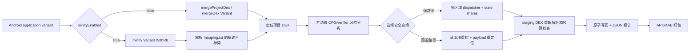

# DexCfgObfuscator 中文文档

[返回项目首页](../README.md) | [English](README_EN.md)

## 1. 项目简介

DexCfgObfuscator 是一个面向 Android application 模块的 DEX 控制流混淆 Gradle 插件。
它在 D8/R8 已经生成目标 DEX、但 APK/AAB 尚未打包时工作，只处理显式配置的业务包或类前缀。

项目的设计目标是：在优先保证 ART verifier 和运行语义正确的前提下，提高 JADX、JEB 等静态分析
工具恢复线性控制流的成本。所有处理均在本机构建过程中完成，插件本身不会上传源码、DEX、mapping
或报告。

它不是：

- 类名、方法名或资源名混淆器；这些仍由 R8/ProGuard 负责。
- 字符串加密工具；可以与 StringFog 等工具组合使用。
- 加密、DRM 或绝对防逆向方案。
- “保证 AI 无法理解代码”的方案。

当前插件坐标：

| 项目 | 值 |
|---|---|
| Gradle Plugin ID | `com.hunter.dexcfgobf` |
| Group | `com.hunter` |
| Version | `0.0.7` |
| Java | 17 |
| 当前开发基线 | Gradle 9.6.1、AGP 9.3.1 |
| DEX 实现 | `com.android.tools.smali:smali-dexlib2:3.0.9` |

## 2. 当前已经实现的能力

### 2.1 变体和 R8 接入

- 使用 `androidComponents.onVariants` 发现 Android application 变体。
- debug 未开启 minify 时优先锚定 `mergeProjectDex<Variant>`；若应用任务图只提供
  `mergeDex<Variant>`，则安全回退到该任务，并继续只变换显式白名单类。
- release 开启 minify 时，在 `minify<Variant>WithR8` 后处理最终 DEX。
- release 读取官方 `SingleArtifact.OBFUSCATION_MAPPING_FILE`，将 `obfClass` 中的原始类名前缀
  解析成 R8 后的精确类名集合。
- mapping 缺失或一个目标类都没有解析出来时，release 构建直接失败，避免静默漏混淆。
- 支持 `-repackageclasses` 场景，不需要直接放开整个重打包目录。
- 按每个 DEX 的文件头自动选择 `dex.035/037/038/039/040/041` 指令表，避免把
  `dex.039` 的 `invoke-polymorphic` / `invoke-custom` 误解析成旧 odex quick 指令。

### 2.2 多区域控制流平坦化

满足强平坦化安全条件的方法会被拆分成多个基本块，并按混淆等级分配到 2–4 个独立区域：

- 每个区域拥有自己的 sparse-switch dispatcher。
- 每个区域使用独立的随机 32 位状态 key 和编码常量。
- 跨区域跳转通过随机 gateway 进入目标 dispatcher。
- 方法中的 `return` 和 `throw` 保持真实退出语义。
- 分支和 fall-through 会被重建为显式状态迁移。

### 2.3 状态寄存器拆分

强平坦化不会长期把 dispatcher 状态保存在一个明显寄存器中：

```text
state = shareA XOR shareB
```

- 两份 share 分别保存在专用寄存器中。
- 仅在进入 dispatcher 前短暂合并。
- route 寄存器在 trampoline 中滚动变化。
- 原业务寄存器整体平移，强模板固定增加 4 个寄存器。

### 2.4 真实可达的等价路径

插件不只生成永远不会执行的恒假分支。选中的真实目标块会获得两条语义等价的 alias case：

- 正常运行会根据 route 动态选择其中一条。
- 两条路径拥有相近的结构。
- alias 只修改专用 route/state-share 寄存器。
- 最终汇入同一真实基本块，不改变业务寄存器和副作用。

入口块也会经过 alias，因此至少一组干扰路径会出现在正常执行路径中。

### 2.5 多模板状态编码

不同方法、区域和 seed 会选择不同编码组合。目前包含 8 类可逆编码形状，并组合两种 route 更新方式，
报告中会记录类似以下模板名称：

```text
regional-shared-route-add-add-xor
regional-shared-route-xor-xor-add-xor
```

这些编码用于增加结构差异，不作为密码学保护。

### 2.6 原始 switch 增强

对于源码原有的 packed/sparse switch，安全路径会：

- 给 selector 分配独立 scratch，不覆盖原 selector。
- 使用 `XOR → 奇数乘法 → ADD → XOR` 编码原 case key。
- 将连续 case 转换成随机正负 32 位 sparse key。
- 混入大量伪 case，并让真实 case 与伪 case 使用相近 trampoline 结构。
- 增加第二层 char dispatcher，优先使用 `!`、`@`、`~` 等可见 ASCII 字符 key。
- 伪 case 最终进入原 default，不改变业务效果。

不同等级的单个 switch 目标 case 数：

| 等级 | 目标 case 数 | 单方法累计 case 预算 |
|---|---:|---:|
| `LOW` | 12–24 | 48 |
| `MEDIUM` | 50–80 | 160 |
| `HIGH` | 80–95 | 240 |

反编译器如何显示 case 并不是稳定 API。即使 DEX key 落在字符范围，JADX/JEB 仍可能显示十进制整数。

### 2.7 基本块重排和 payload 重定位

不适合强平坦化的方法会尝试安全的基本块物理重排：

- 保留真实 CFG，只打乱线性指令布局。
- 对 fall-through 补充显式 goto。
- 使用 dexlib2 `Label` 重绑分支目标。
- 支持尾部 `fill-array-data`、packed-switch、sparse-switch payload 抽取、对齐和重定位。
- 让 dexlib2 自动完成 `GOTO → GOTO_16 → GOTO_32` 升格。

### 2.8 try/catch 支持

try/catch 默认支持，不需要宿主配置额外开关：

- 保存并重建 try 区间、catch type 和 handler。
- 保证 `move-exception` 只位于合法 handler 入口。
- 对 verifier 风险高的方法优先使用不增加新 CFG 汇合边的重排路径。
- 无法证明安全时保持原方法或回退，不强行变换。

### 2.9 verifier 类型分析和寄存器分离

插件会分析 verifier 类型和寄存器活跃范围。一个原始 vreg 如果在不同、不重叠生命周期中先后保存
`String`、数组、对象或整数，可以被拆到不同物理寄存器，再尝试进入强模板。

出现以下情况时会保守回退：

- 需要复杂 phi copy。
- invoke-range 连续性无法保持。
- wide/narrow 生命周期冲突。
- 未初始化对象或 monitor 语义存在风险。
- 指令格式无法表示平移后的寄存器号。

### 2.10 写回前验证和原子提交

每个 DEX 都先复制到 producer 目录外的 staging 目录：

1. 在 staging DEX 上完成变换。
2. 重新序列化并解析临时 DEX。
3. 检查寄存器范围、wide 寄存器、分支目标和短分支距离。
4. 检查 switch/array payload 对齐、孤立 payload 和非法跳入 payload。
5. 检查 `move-exception`、handler、try 区间顺序和重叠。
6. 检查整体覆盖率和 DEX 体积预算。
7. 全部成功后才替换 producer DEX。
8. 提交中途失败时使用 backup 恢复。

这是一道本地结构验证门，不等于真实设备上的 ART 验证和业务回归测试。

### 2.11 变换后方法预算

除了变换前的 `maxInstructions`，插件还会检查变换后的 DEX code units 和实际分支距离。
当前内部预算如下，属于实现细节，后续版本可能调整：

| 等级 | 最大 code units | 最低允许量 | 最大增长倍数 |
|---|---:|---:|---:|
| `LOW` | 12,000 | 4,096 | 64× |
| `MEDIUM` | 20,000 | 8,192 | 128× |
| `HIGH` | 28,000 | 12,000 | 192× |

超限时先放弃强模板或 switch padding，再尝试普通基本块重排。

## 3. 工作流水线



## 4. 获取插件

### 4.1 使用发布 ZIP（推荐给外部使用者）

发布包不是单独复制的 JAR，而是包含实现 JAR、POM、Gradle plugin marker 和校验文件的文件夹式
Maven 仓库：

```text
dex-cfg-obfuscator-0.0.7-maven-repo.zip
└── maven-repo/
    └── com/hunter/...
```

解压到稳定目录，然后在宿主的 `settings.gradle` 指向 `maven-repo/`。

### 4.2 clone 或 Git submodule

推荐让插件仓库和 Android 工程处于同级目录：

```text
workspace/
├── YourAndroidApp/
└── DexCfgObfuscator/
    └── maven-repo/
```

也可以将本项目作为 submodule 放入宿主的 `tools/` 或 `external/` 目录，只要仓库路径配置正确即可。

### 4.3 从源码发布到本地目录

```bash
cd DexCfgObfuscator
./gradlew clean test validatePlugins publish
```

`publish` 会把实现组件和 plugin marker 一起写入本仓库的 `maven-repo/`。

## 5. 宿主工程接入

### 5.1 Groovy `settings.gradle`

```groovy
pluginManagement {
    def dexObfRepo = providers.gradleProperty("dexCfgObfuscatorRepo")
            .getOrElse("../DexCfgObfuscator/maven-repo")
    def repoFile = file(dexObfRepo)
    if (!repoFile.isAbsolute()) {
        repoFile = new File(rootDir, dexObfRepo)
    }

    repositories {
        maven {
            name = "DexCfgObfuscatorLocalRepo"
            url = uri(repoFile)
        }
        gradlePluginPortal()
        google()
        mavenCentral()
    }
}
```

自定义路径可以放进宿主的 `gradle.properties`：

```properties
dexCfgObfuscatorRepo=/absolute/path/to/DexCfgObfuscator/maven-repo
```

### 5.2 Kotlin `settings.gradle.kts`

```kotlin
pluginManagement {
    val configured = providers.gradleProperty("dexCfgObfuscatorRepo")
        .orElse("../DexCfgObfuscator/maven-repo")
        .get()
    val candidate = file(configured)
    val repoDir = if (candidate.isAbsolute) candidate else rootDir.resolve(configured)

    repositories {
        maven {
            name = "DexCfgObfuscatorLocalRepo"
            url = uri(repoDir)
        }
        gradlePluginPortal()
        google()
        mavenCentral()
    }
}
```

### 5.3 Groovy application 模块 `build.gradle`

```groovy
import com.hunter.dexcfgobf.gradle.ObfuscationLevel

plugins {
    id 'com.android.application'
    id 'com.hunter.dexcfgobf' version '0.0.7'
}

dexControlFlowObfuscator {
    enabled true
    level ObfuscationLevel.MEDIUM

    // 前缀匹配；只填写自己拥有并经过测试的业务代码。
    obfClass = [
            'com.example.app',
            'com.example.security'
    ]

    // 启动、动态加载、极端大方法或暂时不想处理的区域可以排除。
    blackClass = [
            'com.example.app.bootstrap',
            'com.example.app.generated'
    ]
}
```

### 5.4 Kotlin application 模块 `build.gradle.kts`

```kotlin
import com.hunter.dexcfgobf.gradle.ObfuscationLevel

plugins {
    id("com.android.application")
    id("com.hunter.dexcfgobf") version "0.0.7"
}

dexControlFlowObfuscator {
    enabled = true
    level = ObfuscationLevel.MEDIUM
    obfClass = listOf("com.example.app", "com.example.security")
    blackClass = listOf("com.example.app.bootstrap", "com.example.app.generated")
}
```

### 5.5 构建

当前 `0.0.7` 的 DEX 适配层仍通过 producer 任务输出执行就地后处理。插件会记录成功变换后的 DEX
目录内容指纹；连续增量构建复用完全相同的 producer 输出时会直接跳过，源码或上游 DEX 变化后则重新处理。
发布构建仍建议定期使用干净构建作为最终验证：

```bash
./gradlew :app:assembleRelease --rerun-tasks
# 或
./gradlew clean :app:assembleRelease
```

需要强制从上游重新生成 DEX 时：

```bash
./gradlew :app:assembleDebug --rerun-tasks
```

不要只检查任务是否显示 `SUCCESS`；还应检查日志中的 `dexFailed=0` 和生成的 JSON 报告。

## 6. DSL 配置

宿主只公开稳定且确实需要选择的字段。结构验证、try/catch 支持、类型分离、payload 重定位、
多模板和 JSON 报告默认固定开启。

| 字段 | 类型 | 默认值 | 说明 |
|---|---|---|---|
| `enabled` | `boolean` | `true` | application 的所有变体总开关 |
| `level` | `ObfuscationLevel` | `MEDIUM` | `LOW`、`MEDIUM`、`HIGH` |
| `obfClass` | `List<String>` | `[]` | 要处理的包或类前缀 |
| `blackClass` | `List<String>` | `[]` | 追加到内置排除表的前缀 |
| `adversarialCommands` | `List<List<String>>` | `[]` | 可选外部回归命令，非 shell 字符串 |
| `adversarialTimeoutSeconds` | `int` | `300` | 每个外部命令的超时秒数 |

内置排除前缀：

```text
android/
androidx/
kotlin/
kotlinx/
com/google/
```

`obfClass` 和 `blackClass` 都是前缀匹配，不是正则表达式。请尽量使用完整、明确的业务包前缀，
避免 `com.foo` 同时匹配到不希望处理的 `com.foobar`。

## 7. 混淆等级

| 等级 | dispatcher 区域 | alias 目标上限 | 原始 switch 目标 case | 适用场景 |
|---|---:|---:|---:|---|
| `LOW` | 2 | 4 个目标/8 个 alias case | 12–24 | 体积和速度优先 |
| `MEDIUM` | 3 | 6 个目标/12 个 alias case | 50–80 | 默认平衡档 |
| `HIGH` | 4 | 8 个目标/16 个 alias case | 80–95 | 重点方法，接受更大体积 |

实际区域和 alias 数不会超过方法可用基本块数。等级越高不代表所有方法都能进入强模板；安全分析失败时
仍会回退或跳过。

## 8. 对抗命令

`adversarialCommands` 用于在混淆后自动运行 JADX、内部校验器或其他回归工具。每项必须是参数数组，
插件使用 `ProcessBuilder` 直接执行，不经过 shell 二次解析。

```groovy
dexControlFlowObfuscator {
    // tools/check-obfuscated-dex 是可执行文件，第一个参数不是一整段 shell 命令。
    adversarialCommands = [[
            'tools/check-obfuscated-dex',
            '--dex-dir', '{dexDir}',
            '--report', '{report}',
            '--variant', '{variant}'
    ]]
    adversarialTimeoutSeconds = 300
}
```

支持的占位符：

- `{dexDir}`：当前处理的 DEX 目录。
- `{report}`：当前变体 JSON 报告。
- `{variant}`：变体名称。

命令非零退出或超时会让构建失败。

## 9. JSON 报告

默认路径：

```text
<module>/build/reports/dex-cfg-obfuscator/<variant>.json
```

当前 schema 版本为 `3`。顶层包含：

- `variant`、`seed`。
- `summary`：DEX 数、扫描/混淆/跳过方法数、flatten/reorder 数量、switch case 数、alias、
  dispatcher、状态分享、体积增量。
- `skipReasons`：过小、过大、寄存器预算、verifier 分析、unsupported、already-obfuscated 等。
- `budgets`：本次构建实际使用的覆盖率和体积门槛。
- `methods`：每个方法的 mode、reason、template、前后 instructions/code units/registers、
  try/switch/payload 风险和 switch/dispatcher 统计。

快速查看：

```bash
jq '.summary' app/build/reports/dex-cfg-obfuscator/release.json
jq '.skipReasons' app/build/reports/dex-cfg-obfuscator/release.json
jq '.methods[] | select(.mode == "flattened") | {owner,name,template,dispatcherRegions}' \
  app/build/reports/dex-cfg-obfuscator/release.json
```

建议在 CI 中至少保存报告并对比：

- `dexFailed` 必须为 0。
- `methodsObfuscated` 和 `obfuscatedRatio` 不应异常下降。
- `sizeIncreasePercent` 不应突然增长。
- `alreadyObfuscated` 在干净构建中应接近 0。

## 10. 验证建议

### 10.1 插件项目测试

```bash
./gradlew clean test validatePlugins
```

现有测试覆盖语义解释、多 seed 模板、try/catch、payload、R8 mapping、verifier 类型分离、
结构验证、报告统计和变换后预算。

### 10.2 宿主构建验证

```bash
./gradlew :app:assembleDebug --rerun-tasks
./gradlew :app:assembleRelease --rerun-tasks
```

### 10.3 反编译回归

使用项目支持的 JADX/JEB 版本验证：

- APK 仍能被工具打开。
- 重点方法出现区域 dispatcher、随机 case、alias 或安全重排。
- 原始 switch case 数符合预期。
- 不把“JADX 报错”作为唯一效果指标；更重要的是运行语义和剩余 CFG 复杂度。

### 10.4 ART 和真机验证

至少覆盖应用支持的最低、主流和最新 Android 版本：

```bash
adb install -r path/to/app-release.apk
adb shell am force-stop com.example.app
adb shell monkey -p com.example.app 1
```

设备支持时可额外执行：

```bash
adb shell cmd package compile -m verify -f com.example.app
```

检查 logcat 中的 `VerifyError`、`Rejecting class`、`verification failed`、`FATAL EXCEPTION`，并执行
关键业务回归。构建成功和安装成功都不能单独证明运行时正确。

## 11. 生成外部分发包

```bash
chmod +x build-release.sh
./build-release.sh
```

脚本执行：

1. `clean test validatePlugins`。
2. `publish` 到本仓库 `maven-repo/`。
3. 校验实现 JAR 和 Gradle plugin marker。
4. 打包 `maven-repo/`、根 README 和中英文文档。
5. 生成 SHA-256 文件。

接收方只需解压 ZIP、配置 `pluginManagement.repositories`、应用相同版本号，不需要安装到
`mavenLocal()`。

## 12. 常见问题

### 12.1 `Plugin ... was not found`

检查：

- Maven 路径是否指向解压后的 `maven-repo/`，而不是 ZIP 或 JAR。
- `pluginManagement.repositories` 是否位于 `settings.gradle(.kts)`。
- marker 目录中是否存在 `com.hunter.dexcfgobf.gradle.plugin-<version>.pom`。
- 插件版本是否与仓库中的版本目录一致。

### 12.2 release 提示找不到 mapping

release + minify 路径要求 R8 `mapping.txt`。检查：

- `minifyEnabled true` 的变体是否真的执行 R8。
- 是否自定义了会删除或移动 mapping 的任务。
- `obfClass` 是否填写的是 R8 前的原始类名。

### 12.3 `R8 mapping resolved zero included classes`

通常表示 `obfClass` 没有匹配到业务类，或者目标类被 `blackClass`/内置前缀排除。使用更精确的原始
包名，并检查 R8 mapping 左侧类名。

### 12.4 日志出现 `fallback->reorder`

这是预期的安全策略，不一定是错误。常见原因是寄存器超过某种指令格式范围、verifier 类型不明确、
range/wide 约束或方法结构不适合强模板。最终 `dexFailed=0` 且应用验证通过时，方法会采用更保守的
重排路径。

### 12.5 `DEX size increase ... exceeds maxSizeIncreasePercent`

说明整个 DEX 体积增长超过内部 100% 上限。优先：

- 查看日志是否出现 `skip unchanged already-obfuscated DEX dir`；若没有且怀疑使用了旧插件，确认宿主版本为 `0.0.7`。
- 将 `HIGH` 降为 `MEDIUM` 或 `LOW`。
- 缩小 `obfClass` 范围。
- 将超大/大量 switch 的生成代码加入 `blackClass`。

### 12.6 连续第二次构建突然膨胀

`0.0.7` 仍是 producer 输出目录的就地后处理模式，但已经增加目录级内容指纹：只有当前 DEX 与上次
成功变换后的字节完全一致时才跳过。producer 重新生成、源码改变或 DEX 内容变化都会使指纹失配并
触发正常混淆，从而避免连续构建再次扩大原始 switch padding。

如果从 `0.0.4` 升级时 build 目录里已经残留被旧版处理过的 DEX，应先执行一次：

```bash
./gradlew :app:assembleRelease --rerun-tasks
# 或先 clean
```

后续仍应迁移到具有显式输入/输出的稳定 AGP DEX Artifact Transform，以取代任务名和 producer
目录适配。

## 13. 已知限制

- 当前只支持 `com.android.application`，没有为 Android library/AAR 注册处理流程。
- 当前 AGP 适配仍依赖 producer 任务名称和输出目录；不是标准 post-R8 DEX Artifact Transform。
- 一些短寄存器格式无法在整体平移后表示 v16 以上寄存器，会回退重排。
- invoke-range、wide、monitor、未初始化对象、复杂异常边等方法可能只重排或跳过。
- 可见字符 case 的反编译显示取决于工具版本。
- 体积和启动/解释开销会随等级、方法数量和原始 switch 数明显增加。
- 本地结构验证不能替代真实 ART、OEM ROM、性能和业务回归。
- 混淆不能阻止动态调试、运行时 dump、hook 或有针对性的语义分析。

## 14. 项目结构

```text
DexCfgObfuscator/
├── build.gradle
├── build-release.sh
├── README.md
├── doc/
│   ├── README_CN.md
│   └── README_EN.md
├── maven-repo/                 # 可直接消费的文件夹式 Maven 仓库
├── release/                    # build-release.sh 生成，默认不提交
└── src/
    ├── main/groovy/com/hunter/dexcfgobf/
    │   ├── gradle/             # Gradle 插件和 DSL
    │   ├── CfgFlattener.java
    │   ├── ControlFlowFlattener.java
    │   ├── DexStructuralVerifier.java
    │   ├── VerifierTypeSeparator.java
    │   └── ...
    └── test/java/com/hunter/dexcfgobf/
```

## 15. 开源发布前检查

仓库当前尚未包含 `LICENSE`。正式公开发布前建议由项目所有者完成：

- 选择并加入 `LICENSE`。
- 补充真实的 GitHub 仓库地址、Issue 和贡献流程。
- 确认仓库历史、示例配置和发布产物不包含密钥、签名文件或业务私有数据。
- 在干净 clone 中执行 `./build-release.sh`。
- 校验发布 ZIP 的 SHA-256。
- 在至少一个最小示例 App 和一个真实 App 上执行 debug/release、JADX、ART 和业务回归。

## 16. 贡献原则

- 正确性和可回退性优先于混淆覆盖率。
- 新变换必须附带语义测试、DEX 重新解析测试和边界用例。
- 不使用 AGP internal API，除非明确隔离版本并记录迁移方案。
- 不把真实业务包名、密钥或私有构建环境写入插件默认值。
- 文档必须区分“已实现”“计划中”和“只能依赖外部验证”的能力。
