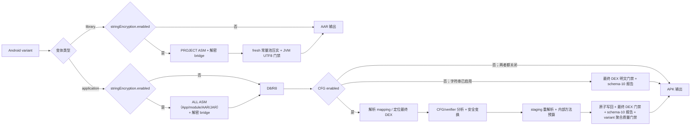

# DexCfgObfuscator 中文文档

[返回项目首页](../README.md) | [English](README_EN.md)

## 1. 项目简介

DexCfgObfuscator 是一个 Android 字符串与 DEX 控制流混淆 Gradle 插件，包含两个独立阶段：

- D8/R8 前，对 application 的完整依赖 class 或 library 当前模块的项目 class 执行 ASM 字符串改写，
  并生成运行时解密桥。
- application 最终 DEX 生成后、APK/AAB 打包前，对显式配置的业务包执行控制流变换、结构验证和报告。

字符串阶段在 application 使用 AGP `InstrumentationScope.ALL`：按 `packages` 自动覆盖 App 自身、
本地 project module，以及外部 AAR/JAR 中匹配的 class。Android library 独立构建时使用
`InstrumentationScope.PROJECT`，只处理该 library 自身的项目 class。

项目的设计目标是：在优先保证 ART verifier 和运行语义正确的前提下，提高 JADX、JEB 等静态分析
工具恢复线性控制流的成本。所有处理均在本机构建过程中完成，插件本身不会上传源码、DEX、mapping
或报告。

它不负责：

- 类名、方法名或资源名混淆器；这些仍由 R8/ProGuard 负责。
- 服务端秘密、API secret、密码或私钥存储。这里的“字符串加密”是静态混淆：密文、密钥和解密逻辑
  都随客户端分发，明文必然在运行期出现。
- DRM 或绝对防逆向方案；启用本字符串阶段时不能同时启用 StringFog。
- “保证 AI 无法理解代码”的方案。

当前插件坐标：

| 项目 | 值 |
|---|---|
| Gradle Plugin ID | `com.hunter.dexcfgobf` |
| Group | `com.hunter` |
| Version | `0.0.14` |
| Java | 17 |
| 当前开发基线 | Gradle 9.6.1、AGP 9.3.1 |
| DEX 实现 | `com.android.tools.smali:smali-dexlib2:3.0.9` |

## 快速接入（先看这里）

下面以 **Groovy DSL** 为例给出一套可以直接落地的最小配置，依次需要修改项目级
`settings.gradle`、项目根 `build.gradle` 和 Android 模块的 `build.gradle`。Kotlin DSL、
自定义算法、质量门禁以及 library 的完整说明仍可在后面的“获取插件”“宿主工程接入”和
“DSL 配置”章节中查阅。

### 第 1 步：准备本地 Maven 仓库

下载并解压发布包 `dex-cfg-obfuscator-0.0.14-maven-repo.zip`。宿主工程需要指向解压后的
`maven-repo/` 目录，而不是只复制其中的实现 JAR：

```text
workspace/
├── YourAndroidApp/
│   ├── settings.gradle
│   └── build.gradle
└── DexCfgObfuscator/
    └── maven-repo/
```

也可以把 DexCfgObfuscator 作为 Git submodule 放到宿主工程的 `external/` 或 `tools/` 目录。

### 第 2 步：在项目级 `settings.gradle` 注册插件仓库

`pluginManagement` 必须是 `settings.gradle` 的第一个代码块，并且必须能够同时找到实现组件和
Gradle plugin marker。项目已有 `pluginManagement` 时，把下面的 `maven` 仓库合并进去，不要再创建
第二个 `pluginManagement`：

```groovy
pluginManagement {
    def dexObfRepo = providers.gradleProperty('dexCfgObfuscatorRepo')
            .getOrElse('../DexCfgObfuscator/maven-repo')
    def repoFile = file(dexObfRepo)
    if (!repoFile.isAbsolute()) {
        repoFile = new File(rootDir, dexObfRepo)
    }

    repositories {
        maven {
            name = 'DexCfgObfuscatorLocalRepo'
            url = uri(repoFile)
        }
        gradlePluginPortal()
        google()
        mavenCentral()
    }
}
```

如果每台开发机的目录不同，可在宿主项目的 `gradle.properties` 覆盖路径：

```properties
dexCfgObfuscatorRepo=/absolute/path/to/DexCfgObfuscator/maven-repo
```

### 第 3 步：在项目根 `build.gradle` 声明插件版本

保留宿主已有的 Android 插件及其版本，只增加下面这一行。项目级使用 `apply false`，不要在根项目
直接执行 Android 字节码变换：

```groovy
plugins {
    // 保留这里已有的 Android/Kotlin 插件声明。
    id 'com.hunter.dexcfgobf' version '0.0.14' apply false
}
```

如果不在根项目统一管理插件版本，也可以在模块的 `plugins` 块中直接写
`id 'com.hunter.dexcfgobf' version '0.0.14'`，两种写法选择一种即可，不要重复声明不同版本。
根脚本原来没有 `plugins {}` 时，新建的块应放在已有 `buildscript {}` 之后、其他普通配置块之前。

### 第 4 步：在 application 模块 `build.gradle` 应用并配置

下面的配置让 Debug/Release 都执行字符串保护，而 DEX CFG 只处理 Release。包名采用前缀匹配，
请替换为自己拥有并完成回归测试的业务包：

```groovy
import com.hunter.dexcfgobf.gradle.ObfuscationLevel
import com.hunter.dexcfgobf.string.StringEncryptionMode

plugins {
    id 'com.android.application'
    id 'com.hunter.dexcfgobf'
}

dexControlFlowObfuscator {
    // 只控制 application 的后置 DEX CFG。
    enabled true
    enabledVariants = ['release']
    level ObfuscationLevel.MEDIUM

    obfClass = ['com.example.app']
    blackClass = [
            'com.example.app.generated',
            'com.example.app.bootstrap'
    ]

    stringEncryption {
        // 独立于外层 enabled；application 会处理完整依赖图中命中 packages 的 class。
        enabled true
        mode StringEncryptionMode.BYTES
        packages = ['com.example.app']
        excludePackages = ['com.example.app.databinding']
    }
}
```

如果只需要字符串保护、不需要 CFG，将外层 `enabled` 改为 `false` 即可；内层
`stringEncryption.enabled true` 仍然生效。普通接入只需要上面四个字符串字段。最终 DEX 明文、
不安全跳过、主动过滤、最小加密数量、解密器保护和 release 完整覆盖率等安全门禁已经采用安全默认值，
无需把它们逐项复制到业务脚本。

### 第 5 步：需要独立发布受保护 AAR 时，在 library 模块应用

application 的 `ALL` scope 已经自动覆盖命中 `packages` 的本地 module、外部 AAR/JAR，普通 App
不需要在每个依赖模块重复应用插件。只有 library 需要脱离 App 独立构建、发布受保护 AAR 时，才在
library 模块应用插件；library 使用 `PROJECT` scope，只处理自身项目 class：

```groovy
import com.hunter.dexcfgobf.string.StringEncryptionMode

plugins {
    id 'com.android.library'
    id 'com.hunter.dexcfgobf'
}

dexControlFlowObfuscator {
    // library 不注册后置 DEX CFG；这里只配置它自己的字符串保护范围。
    enabled false
    obfClass = ['com.example.security']
    stringEncryption {
        enabled true
        mode StringEncryptionMode.BYTES
        packages = ['com.example.security']
        excludePackages = ['com.example.security.databinding']
    }
}
```

如需只保护 library 的部分 variant，可使用后文的高级字段
`stringEncryption.enabledVariants`。普通 application 接入不需要配置 dependency evidence。

### 第 6 步：构建并检查报告

当前版本启用字符串保护时需要关闭 configuration cache。安全默认值会要求 Release 具有完整覆盖
证明，因此 Release 构建应使用 `--rerun-tasks` 强制重新执行上游变换：

```bash
./gradlew :app:assembleRelease --rerun-tasks --no-configuration-cache
```

application 报告位于：

```text
app/build/reports/dex-cfg-obfuscator/release.json
```

独立验证 library 时可以执行：

```bash
./gradlew :securityLibrary:bundleReleaseAar --rerun-tasks --no-configuration-cache
```

library 没有 application 最终 DEX，因此不会生成 application 的 schema-10 JSON；它会在 AAR 打包前
执行 class 常量池压实和 JVM 明文门禁，结果显示在构建日志中。

至少确认构建日志和报告中的 `dexFailed=0`、`stringCoverageStatus=FULL`、
`stringPlaintextVerified=true`、`stringPlaintextLeaks=0`。成功编译只代表本地结构门禁通过，发布前仍要
在目标 Android 版本上执行冷启动、关键业务路径以及 application/library 边界的真机回归。

## 2. 当前已经实现的能力

### 2.1 D8/R8 前字符串保护

- 支持 Android application 和 library 变体：application 使用 `ALL` scope，按包前缀处理 App、
  本地 project module 和外部 AAR/JAR；library 使用 `PROJECT` scope，只处理自身项目 class。
- 改写方法体中的 String `LDC`；对带 `ConstantValue` 的 `static final String` 移除明文常量值，
  并在原有或新建的 `<clinit>` 中解密赋值。
- 为每个变体生成默认的 `<namespace>.DexStringDecryptor_<projectHash>`；project path 短摘要避免
  app/library 共用 namespace 时发生 duplicate class，也可通过 `bridgeClass` 显式改名。
- 提供内置的按调用点派生 key 与可逆字节流算法，也支持宿主自定义构建期加密、运行期解密和 key 生成器。
- 支持 `BYTES` 与 `BASE64` 两种承载方式；解密结果会执行 `intern()`，保持 Java 字面量身份语义。
- 自动排除生成 bridge、自定义运行时 implementation、`BuildConfig`、`R/R2`；空串、纯空白、
  超过 `maxStringBytes`、非配对 surrogate 或被 `shouldEncrypt/shouldFog` 过滤的字符串会保留原样。
- 默认逐常量验证 `decrypt(encrypt(value,key),key)`，并拒绝密文字节等于明文字节的恒等“加密”；
  key 精确等于明文字节也一律拒绝，长度至少 8 字节的完整明文序列不得原样嵌入 key 或密文载体。
- application 会扫描最终 DEX 中的运行时字符串载荷：`const-string`、static String 初值、递归
  annotation String value，以及已引用的非结构性 call-site 名称和参数。本轮已加密原文仍以这些形态出现时，默认使构建
  失败；全 string-pool 同值仅用于诊断，避免字段名、方法名、debug/record 元数据造成误报。可用
  `strictWholeStringPool true` 恢复“任意同值都失败”。schema-10 JSON 不写明文、原文摘要、密文或
  key；APK 必然携带密文、key carrier 和运行时 bridge，门禁保证的是所选受保护原文不再出现在约定的
  最终 DEX 运行时载荷中，而不是 APK 不含恢复材料。为保证增量构建不能绕过门禁，SHA-256、原始
  member scope 与统计会以带校验和的本地证据写入 `build/intermediates`，`clean` 会删除；该证据不得
  提交或随发布包分发。
- library 会在 AAR 打包前用新的 ASM 常量池重建本轮已修改 class，删除 AGP seeded writer 可能遗留的
  不可达旧明文；随后对 transform 输出目录中递归发现的 `.class` 和 class JAR 扫描 JVM
  LDC/ConstantValue、递归 annotation value 与 invokedynamic/condy String 名称和参数。全部
  `CONSTANT_Utf8` 同值仍计入全池碰撞诊断；仅在 `strictWholeStringPool true` 时因此失败。
- 完整 JVM 方法先经 `CodeSizeEvaluator` dry-run：全 BYTES 的保守预算超限时，整个方法统一切换为
  BASE64；全 BASE64 仍超限则在 ASM 写出 class 前明确失败。插件不会生成逐字面量混合 carrier 的
  半成品，也不会把 `MethodTooLargeException` 留到后续 javac/D8。
- 所有 `invokedynamic` / `ConstantDynamic` 中无法安全动态替换的可执行 bootstrap 字符串和
  非结构性调用点名称默认 fail closed。javac concat、lambda、record 的调用点名称只有在完整编译器
  结构校验通过后才作为结构元数据放行；通过完整 `ObjectMethods.bootstrap` 校验的 record 组件名参数
  同样不登记为受保护业务字符串。每个 `ConstantDynamic` 名称都保持 unsupported。其余 unsupported
  值可显式放宽并在 schema-10 报告中查看数量。

### 2.2 变体和 R8 接入

- 使用 `androidComponents.onVariants` 发现 Android application 变体。
- debug 未开启 minify 时优先锚定 `mergeProjectDex<Variant>`；若应用任务图只提供
  `mergeDex<Variant>`，则安全回退到该任务，并继续只变换显式白名单类。
- release 开启 minify 时，在 `minify<Variant>WithR8` 后处理最终 DEX。
- release 读取官方 `SingleArtifact.OBFUSCATION_MAPPING_FILE`，将 `obfClass` 中的原始类名前缀
  解析成 R8 后的精确类名集合。
- mapping 缺失或一个目标类都没有解析出来时，release 构建直接失败，避免静默漏混淆。
- 支持 `-repackageclasses` 场景，不需要直接放开整个重打包目录。
- 按每个 DEX 的文件头自动选择 `dex.035/037/038/039/040/041` 指令表，避免把
  `dex.039` 的 `invoke-polymorphic` / `invoke-custom` 误解析成旧 odex quick 指令。

### 2.3 多区域控制流平坦化

满足强平坦化安全条件的方法会被拆分成多个基本块，并按混淆等级分配到 2–4 个独立区域：

- 每个区域拥有自己的 sparse-switch dispatcher。
- 每个区域使用独立的随机 32 位状态 key 和编码常量。
- 跨区域跳转通过随机 gateway 进入目标 dispatcher。
- 方法中的 `return` 和 `throw` 保持真实退出语义。
- 分支和 fall-through 会被重建为显式状态迁移。

### 2.4 状态寄存器拆分

强平坦化不会长期把 dispatcher 状态保存在一个明显寄存器中：

```text
state = shareA XOR shareB
```

- 两份 share 分别保存在专用寄存器中。
- 仅在进入 dispatcher 前短暂合并。
- route 寄存器在 trampoline 中滚动变化。
- 原业务寄存器整体平移，强模板固定增加 4 个寄存器。

### 2.5 真实可达的等价路径

插件不只生成永远不会执行的恒假分支。选中的真实目标块会获得两条语义等价的 alias case：

- 正常运行会根据 route 动态选择其中一条。
- 两条路径拥有相近的结构。
- alias 只修改专用 route/state-share 寄存器。
- 最终汇入同一真实基本块，不改变业务寄存器和副作用。

入口块也会经过 alias，因此至少一组干扰路径会出现在正常执行路径中。

### 2.6 多模板状态编码

不同方法、区域和 seed 会选择不同编码组合。目前包含 8 类可逆编码形状，并组合两种 route 更新方式，
报告中会记录类似以下模板名称：

```text
regional-shared-route-add-add-xor
regional-shared-route-xor-xor-add-xor
```

这些编码用于增加结构差异，不作为密码学保护。

### 2.7 原始 switch 增强

对于源码原有的 packed/sparse switch，安全路径会：

- 给 selector 分配独立 scratch，不覆盖原 selector。
- 使用 `XOR → 奇数乘法 → ADD → XOR` 编码原 case key。
- 将连续 case 转换成随机正负 32 位 sparse key。
- 混入大量伪 case，并让真实 case 与伪 case 使用相近 trampoline 结构。
- 增加第二层 char dispatcher，优先使用 `!`、`@`、`~` 等可见 ASCII 字符 key。
- 伪 case 最终进入原 default，不改变业务效果。

不同等级的单个 switch 目标 case 数：

| 等级 | 目标 case 数 | 单方法累计 case 预算 |
|---|---:|---:|
| `LOW` | 12–24 | 48 |
| `MEDIUM` | 50–80 | 160 |
| `HIGH` | 80–95 | 240 |

反编译器如何显示 case 并不是稳定 API。即使 DEX key 落在字符范围，JADX/JEB 仍可能显示十进制整数。

### 2.8 基本块重排和 payload 重定位

不适合强平坦化的方法会尝试安全的基本块物理重排：

- 保留真实 CFG，只打乱线性指令布局。
- 对 fall-through 补充显式 goto。
- 使用 dexlib2 `Label` 重绑分支目标。
- 支持尾部 `fill-array-data`、packed-switch、sparse-switch payload 抽取、对齐和重定位。
- 让 dexlib2 自动完成 `GOTO → GOTO_16 → GOTO_32` 升格。

### 2.9 try/catch 支持

try/catch 默认支持，不需要宿主配置额外开关：

- 保存并重建 try 区间、catch type 和 handler。
- 保证 `move-exception` 只位于合法 handler 入口。
- 对 verifier 风险高的方法优先使用不增加新 CFG 汇合边的重排路径。
- 无法证明安全时保持原方法或回退，不强行变换。

### 2.10 verifier 类型分析和寄存器分离

插件会分析 verifier 类型和寄存器活跃范围。一个原始 vreg 如果在不同、不重叠生命周期中先后保存
`String`、数组、对象或整数，可以被拆到不同物理寄存器，再尝试进入强模板。

出现以下情况时会保守回退：

- 需要复杂 phi copy。
- invoke-range 连续性无法保持。
- wide/narrow 生命周期冲突。
- 未初始化对象或 monitor 语义存在风险。
- 指令格式无法表示平移后的寄存器号。

### 2.11 staging 验证、原子提交和 variant 质量门禁

每个 DEX 都先复制到 producer 目录外的 staging 目录：

1. 在 staging DEX 上完成变换。
2. 重新序列化并解析临时 DEX。
3. 检查寄存器范围、wide 寄存器、分支目标和短分支距离。
4. 检查 switch/array payload 对齐、孤立 payload 和非法跳入 payload。
5. 检查 `move-exception`、handler、try 区间顺序和重叠。
6. 检查方法级结构/code-unit 预算。
7. 全部成功后才替换 producer DEX。
8. 提交中途失败时使用 backup 恢复。

所有 producer 目录都拿到本轮统计或与当前产物严格绑定的缓存证据后，插件先写
schema-10 报告，再对 **variant 聚合统计** 统一执行 `minObfuscatedMethods`、
`minFlattenedMethods`、`minObfuscatedRatio` 和 `maxSizeIncreasePercent`。这样 fresh/cached
与多目录语义一致。任何 fresh CFG 就地改写前，variant 级事务会备份所有候选 DEX，以及本轮
可能写入的 evidence、state、pending 和 report。后续质量/字符串/明文/对抗门禁或 evidence
提交出现可捕获失败时，插件会恢复整组任务前产物；若进程被强制终止，则 pending marker 会在
下一次构建 fail closed，并要求 clean `--rerun-tasks`。

这是一道本地结构验证门，不等于真实设备上的 ART 验证和业务回归测试。

### 2.12 变换后方法预算

除了变换前的 `maxInstructions`，插件还会检查变换后的 DEX code units 和实际分支距离。
当前内部预算如下，属于实现细节，后续版本可能调整：

| 等级 | 最大 code units | 最低允许量 | 最大增长倍数 |
|---|---:|---:|---:|
| `LOW` | 12,000 | 4,096 | 64× |
| `MEDIUM` | 20,000 | 8,192 | 128× |
| `HIGH` | 28,000 | 12,000 | 192× |

超限时先放弃强模板或 switch padding，再尝试普通基本块重排。

## 3. 工作流水线



library 没有最终 application DEX，因此不注册后置 CFG 任务；它只对 AAR 打包前 transform class
outputs 执行常量池门禁。最终 DEX 的 CFG 防护和全局明文证明仍由消费它的 application 模块负责。

## 4. 获取插件

### 4.1 使用发布 ZIP（推荐给外部使用者）

发布包不是单独复制的 JAR，而是包含实现 JAR、POM、Gradle plugin marker 和校验文件的文件夹式
Maven 仓库：

```text
dex-cfg-obfuscator-0.0.14-maven-repo.zip
└── maven-repo/
    └── com/hunter/...
```

解压到稳定目录，然后在宿主的 `settings.gradle` 指向 `maven-repo/`。

### 4.2 clone 或 Git submodule

推荐让插件仓库和 Android 工程处于同级目录：

```text
workspace/
├── YourAndroidApp/
└── DexCfgObfuscator/
    └── maven-repo/
```

也可以将本项目作为 submodule 放入宿主的 `tools/` 或 `external/` 目录，只要仓库路径配置正确即可。

### 4.3 从源码发布到本地目录

```bash
cd DexCfgObfuscator
./gradlew clean test validatePlugins publish
```

`publish` 会把实现组件和 plugin marker 一起写入本仓库的 `maven-repo/`。

## 5. 宿主工程接入

### 5.1 Groovy `settings.gradle`

```groovy
pluginManagement {
    def dexObfRepo = providers.gradleProperty("dexCfgObfuscatorRepo")
            .getOrElse("../DexCfgObfuscator/maven-repo")
    def repoFile = file(dexObfRepo)
    if (!repoFile.isAbsolute()) {
        repoFile = new File(rootDir, dexObfRepo)
    }

    repositories {
        maven {
            name = "DexCfgObfuscatorLocalRepo"
            url = uri(repoFile)
        }
        gradlePluginPortal()
        google()
        mavenCentral()
    }
}
```

自定义路径可以放进宿主的 `gradle.properties`：

```properties
dexCfgObfuscatorRepo=/absolute/path/to/DexCfgObfuscator/maven-repo
```

### 5.2 Kotlin `settings.gradle.kts`

```kotlin
pluginManagement {
    val configured = providers.gradleProperty("dexCfgObfuscatorRepo")
        .orElse("../DexCfgObfuscator/maven-repo")
        .get()
    val candidate = file(configured)
    val repoDir = if (candidate.isAbsolute) candidate else rootDir.resolve(configured)

    repositories {
        maven {
            name = "DexCfgObfuscatorLocalRepo"
            url = uri(repoDir)
        }
        gradlePluginPortal()
        google()
        mavenCentral()
    }
}
```

### 5.3 Groovy application 模块 `build.gradle`

以下模块示例假定项目根 `build.gradle` 已用 `apply false` 声明 `0.0.14`。如果没有项目级声明，
才在模块的插件 ID 后追加 `version '0.0.14'`。

```groovy
import com.hunter.dexcfgobf.gradle.ObfuscationLevel
import com.hunter.dexcfgobf.string.StringEncryptionMode

plugins {
    id 'com.android.application'
    id 'com.hunter.dexcfgobf'
}

dexControlFlowObfuscator {
    enabled true
    // 可选：CFG 仅处理 release；字符串阶段仍由自己的 enabled 独立控制全部 variant。
    enabledVariants = ['release']
    level ObfuscationLevel.MEDIUM

    // 前缀匹配；只填写自己拥有并经过测试的业务代码。
    obfClass = [
            'com.example.app',
            'com.example.security'
    ]

    // 启动、动态加载、极端大方法或暂时不想处理的区域可以排除。
    blackClass = [
        'com.example.app.bootstrap',
        'com.example.app.generated'
    ]

    // 可选 release 质量门禁；请按真实项目基线设置。
    minObfuscatedMethods = 100
    // 只统计强平坦化方法，安全重排不计入；默认 0 表示不限制。
    minFlattenedMethods = 50
    minObfuscatedRatio = 0.30
    maxSizeIncreasePercent = 50

    stringEncryption {
        // 独立于外层 enabled；application 的 ALL scope 会覆盖完整依赖图。
        enabled true
        mode StringEncryptionMode.BYTES
        packages = ['com.example.app', 'com.example.security']
        excludePackages = ['com.example.app.databinding']
    }
}
```

字符串门禁已经采用安全默认值，普通 App 不需要再抄写数量、泄漏、覆盖率或 dependency evidence
配置。Release 使用 `--rerun-tasks` 获得默认要求的完整覆盖证明。

### 5.4 Kotlin application 模块 `build.gradle.kts`

```kotlin
import com.hunter.dexcfgobf.gradle.ObfuscationLevel
import com.hunter.dexcfgobf.string.StringEncryptionMode

plugins {
    id("com.android.application")
    id("com.hunter.dexcfgobf")
}

dexControlFlowObfuscator {
    enabled = true
    level = ObfuscationLevel.MEDIUM
    obfClass = listOf("com.example.app", "com.example.security")
    blackClass = listOf("com.example.app.bootstrap", "com.example.app.generated")
    minFlattenedMethods = 50 // 安全重排不计入
    stringEncryption {
        enabled = true
        mode = StringEncryptionMode.BYTES
        packages = listOf("com.example.app", "com.example.security")
        excludePackages = listOf("com.example.app.databinding")
    }
}
```

### 5.5 application 仅启用字符串保护

```groovy
import com.hunter.dexcfgobf.string.StringEncryptionMode

dexControlFlowObfuscator {
    // 只关闭 application 的后置 DEX CFG。
    enabled false
    stringEncryption {
        enabled true
        mode StringEncryptionMode.BYTES
        packages = ['com.example.app']
        excludePackages = ['com.example.app.databinding']
    }
}
```

### 5.6 Android library

library 模块也可应用 `com.hunter.dexcfgobf`，但只运行 `PROJECT` scope 的前置字符串阶段。仅当要
独立构建或发布受保护 AAR 时才需要这样配置；被 application 消费的普通 module/AAR/JAR 已由 App
的 `ALL` scope 自动处理。外层 `enabled` 不会为 library 注册 CFG 任务。

```groovy
import com.hunter.dexcfgobf.string.StringEncryptionMode

plugins {
    id 'com.android.library'
    id 'com.hunter.dexcfgobf'
}

dexControlFlowObfuscator {
    enabled false
    obfClass = ['com.example.library']
    stringEncryption {
        enabled true
        // 高级用法：独立 library 只发布 release AAR 时可限制字符串阶段的 variant。
        enabledVariants = ['release']
        mode StringEncryptionMode.BYTES
        packages = ['com.example.library']
        excludePackages = ['com.example.library.databinding']
    }
}
```

AGP visitor writer 可能继续携带已不可达的旧常量池项，因此仅看到调用点已改写还不够。插件在
`transform<Variant>ClassesWithAsm` 末尾以 fresh `ClassWriter` 重建本轮已修改 class；随后
`compact<Variant>LibraryStringConstantPools` 对 transform outputs 中递归发现的 class/class JAR 扫描
JVM LDC/ConstantValue、递归 annotation value 与 invokedynamic/condy String 名称/参数；全部
`CONSTANT_Utf8` 同值同时作为全池诊断，`strictWholeStringPool true` 可让它们也触发失败。
`sync<Variant>LibJars` 和 `bundle<Variant>Aar` 依赖该门禁。

由于常量池压实会就地改写 transform outputs，插件会在 library `clean`/标准 Android 构建开始前
按 canonical `buildDir` 获取 OS 文件锁。锁 inode 位于 `buildDir` 之外，`clean` 无法删除；Gradle Flow
只在所有已调度构建工作（包括失败路径）结束后释放。第二个共用同一绝对 `buildDir` 的进程会立即失败；
请用独立 `buildDir`，不要并发写入。

这里验证的是 **AAR 打包前的 transform class outputs**，不是对已打包 AAR 的再次扫描，也不是消费
application 最终 DEX/APK/AAB 的全局证明。发布 CI 仍应解包最终 AAR 的 `classes.jar` 复核，并在
消费 application 上执行最终 DEX 门禁。

#### 5.6.1 旧版预加密 library evidence 兼容（高级）

`0.0.14` 的普通 application 路径不需要 `dependencyEvidenceProjects` 或
`dependencyEvidenceVariants`：App 的 `ALL` scope 会直接改写完整依赖图，并在最终 DEX 上统一验证。
这两个字段只用于迁移旧构建链：同一 Gradle 构建中的 project library 已经在 App 插桩之前由旧版流程
预加密，App 因而看不到它的原始候选字符串，但仍需把该 library 的旧 member-scoped evidence 合并到
最终 DEX 门禁。此时才显式配置：

```groovy
stringEncryption {
    enabled true
    mode StringEncryptionMode.BYTES
    packages = ['com.example']
    excludePackages = ['com.example.databinding']

    dependencyEvidenceProjects = [':legacySecurityLibrary']
    dependencyEvidenceVariants = ['release']
}
```

这些字段不是加密范围的 include 列表，不能替代 `packages`。新接入项目、本地 module 和普通外部
AAR/JAR 都不要配置它们。

### 5.7 构建

当前 `0.0.14` 的 DEX 适配层仍通过 producer 任务输出执行就地后处理。插件会记录成功变换后的 DEX
目录内容指纹；连续增量构建复用完全相同的 producer 输出时会直接跳过，源码或上游 DEX 变化后则重新处理。
发布构建必须保留 `--rerun-tasks`，让默认完整覆盖门禁看到本轮全部 class；如需同时清理，
可在同一命令中追加 `clean`，但 `clean` 本身不能替代该标记：

```bash
./gradlew :app:assembleRelease --rerun-tasks --no-configuration-cache
# 可选的干净构建
./gradlew clean :app:assembleRelease --rerun-tasks --no-configuration-cache
```

需要强制从上游重新生成 DEX 时：

```bash
./gradlew :app:assembleDebug --rerun-tasks --no-configuration-cache
```

不要只检查任务是否显示 `SUCCESS`；还应检查日志中的 `dexFailed=0` 和生成的 JSON 报告。

## 6. DSL 配置

宿主只公开稳定且确实需要选择的字段。结构验证、try/catch 支持、类型分离、payload 重定位、
多模板和 JSON 报告默认固定开启。

| 字段 | 类型 | 默认值 | 说明 |
|---|---|---|---|
| `enabled` | `boolean` | `true` | 只控制 application 的后置 DEX CFG，不控制字符串阶段 |
| `enabledVariants` | `List<String>` | `[]` | CFG 生效的 variant/buildType；空表示全部 application variant，不影响字符串阶段 |
| `level` | `ObfuscationLevel` | `MEDIUM` | `LOW`、`MEDIUM`、`HIGH` |
| `obfClass` | `List<String>` | `[]` | 要处理的包或类前缀 |
| `blackClass` | `List<String>` | `[]` | 追加到内置排除表的前缀 |
| `minObfuscatedMethods` | `int` | `0` | variant 聚合 CFG 实际混淆方法数下限；0 不限制 |
| `minFlattenedMethods` | `int` | `0` | variant 聚合强平坦化（`flattened`）方法数下限；安全重排不计入，0 不限制 |
| `minObfuscatedRatio` | `double` | `0.0` | variant 聚合 CFG 混淆/扫描方法比例下限，范围 `[0,1]` |
| `maxSizeIncreasePercent` | `double` | `100.0` | variant 聚合 DEX 总体积增幅上限百分比 |
| `adversarialCommands` | `List<List<String>>` | `[]` | 可选外部回归命令，非 shell 字符串 |
| `adversarialTimeoutSeconds` | `int` | `300` | 每个外部命令的超时秒数 |

`stringEncryption {}` 是同一插件内的独立前置阶段：

| 字段 | 默认值 | 说明 |
|---|---|---|
| `enabled` | `false` | 启用字符串改写；兼容 `enable true`。application 使用 `ALL` scope，library 使用 `PROJECT` scope |
| `enabledVariants` | `[]` | 字符串阶段生效的 variant/buildType；空表示全部。主要用于限制独立 library 的发布 variant，普通 App 建议留空 |
| `implementation` | `null` | Android 运行时解密实现 FQCN；若没有 `algorithm`，构建期也实例化同名类 |
| `algorithm` | `null` | 可选构建期算法对象；自定义时仍需提供匹配的 runtime `implementation` |
| `keyGenerator` / `kg` | 内置 | 构建期 key 生成对象或一/二参数 Groovy Closure |
| `mode` | `BYTES` | `BYTES` 或 `BASE64`；兼容 `bytes/base64/text`，其中 `text` 映射到 `BASE64` |
| `packages` / `fogPackages` | 未配置 | 未配置时继承外层 `obfClass`；显式 `[]` 不继承并会因无目标包而失败。application 在完整依赖图中匹配 |
| `excludePackages` | 未配置 | 未配置时继承外层 `blackClass`；显式 `[]` 表示不继承 CFG 排除项 |
| `seed` | `0x6D0F27BD4A91C35E` | 内置确定性 key 派生 seed，不应当作秘密 |
| `maxStringBytes` | `4096` | 单个 UTF-8 明文上限；密文和 key 另有字节码预算 |
| `bridgeClass` | `<namespace>.DexStringDecryptor_<projectHash>` | 生成解密桥 FQCN，必须是顶层类；默认跨模块避重名 |
| `decryptorStatic` | `false` | `false` 使用实现类单例；`true` 调用静态 `decrypt` |
| `verifyRoundTrip` | `true` | 构建期逐常量验证加密/解密可逆 |
| `allowIdentityCiphertext` | `false` | 是否允许密文字节等于明文；仅建议诊断临时使用 |
| `verifyFinalDex` | `true` | application 最终 DEX 是否执行已加密原文运行时载荷检查及全池碰撞诊断 |
| `strictWholeStringPool` | `false` | application/library 是否把 class/member/debug 等名称元数据中的同值也作为泄漏失败；默认使用 exact 执行点和无法解析点的全局 runtime fallback |
| `failOnPlaintextLeak` | `true` | application DEX 或 library JVM 常量池门禁发现泄漏时是否让构建失败 |
| `failOnUnsupportedStringConstants` | `true` | 可执行 bootstrap 字符串或非结构性动态调用点名称无法安全改写时是否 fail closed |
| `minEncryptedStrings` | `1` | 本轮加密常量数量下限；命中范围却没有加密结果时 fail closed |
| `minModifiedClasses` | `1` | 本轮发生字符串改写的 class 数量下限 |
| `maxSkippedStrings` | `Integer.MAX_VALUE` | 允许跳过的字符串数量上限 |
| `maxUnsafeSkippedStrings` | `0` | 超长或非法 Unicode 等技术性未保护字符串上限；默认不允许静默绕过 |
| `maxFilteredStrings` | `0` | 自定义 `shouldEncrypt/shouldFog` 主动过滤字符串上限；有意过滤需显式调整预算 |
| `failOnUnknownCoverage` | `true` | 覆盖状态不可证明时是否失败；由下一字段限定为 release 默认生效 |
| `failOnUnknownCoverageVariants` | `['release']` | 上一门禁生效的 variant/buildType；默认要求 release 完整 rerun 证明 |
| `failOnUnprotectedDecryptor` | `true` | CFG 开启时 bridge/implementation 未命中 CFG 范围是否直接失败 |
| `dependencyEvidenceProjects` | `[]` | 高级旧版兼容：合并预加密 project library 的 member evidence；application `ALL` 正常路径无需配置 |
| `dependencyEvidenceVariants` | `[]` | 高级旧版兼容的 evidence variant/buildType；空表示全部 variant |
| `configurationId` | `""` | 自定义对象状态变化未体现在 class 或 `toString()` 时手动更新指纹 |
| `debug` | `false` | 输出调用点和字节数等 lifecycle 日志，不输出明文；不控制 variant |

minify 构建中，插件把成功加密的普通方法标成内部 CLASS-retention site，并向当前 variant 注入一条
“允许删除/改名、禁止优化该方法”的 R8 规则。存活方法因此保留可映射边界，死方法仍可由 R8 删除；
library 会把同一规则作为 consumer rule 传给最终 application。`static final String` 的真实执行点是
`<clinit>()V`，字段只保留 provenance，不再伪装成 final-Dex field gate。最终门禁综合
`mapping.txt`、`usage.txt`、`seeds.txt` 和实际 DEX：exact site 精确扫描，确证删除的 site 不制造
目标，剩余无法安全解析的 hash 才对全 DEX runtime-readable payload 启用保守 fallback。JSON 的
字符串部分只写分类数量，不写 string site、明文、原文 hash、密文或 key；CFG 的 `methods[]` 仍会
按设计写入 DEX、owner、方法名和 descriptor。内部增量 evidence 会保存原文 SHA-256 和原始 member
scope，因此只能留在本地 `build/intermediates`。

### 6.1 默认算法和承载模式

默认 `ContextHashKeyGenerator` 使用 `SHA-256(seed, location, plaintext)` 为每个调用点派生 16 字节
key；`StreamXorStringCipher` 使用该 key 驱动可逆 XOR 字节流。相同明文在不同位置通常得到不同
key/密文，构建结果可复现，但这不是密码学秘密存储。

- `BYTES`：优先在方法体构造 `byte[]`，常量池不保留 Base64 密文，但方法/DEX 体积增长更明显。
  插件在写出前分别 dry-run 整个方法的全 BYTES 和（必要时）全 BASE64 方案；BYTES 的保守 Code
  上界超限时，该方法全部改用 `BASE64` bridge overload。连 BASE64 都放不下会明确失败，因此
  BYTES 配置的产物中可能有少数“整方法 BASE64”，但同一方法不会混用两类 carrier。
- `BASE64`：密文和 key 作为 Base64 String 常量，产物更紧凑，运行时先解码。

### 6.2 自定义算法与 key 生成器

自定义类不需要实现 StringFog 接口；插件按以下方法约定反射调用：

```java
public byte[] encrypt(String value, byte[] key);
public String decrypt(byte[] value, byte[] key);

// 可选；兼容旧名称 shouldFog(String)
public boolean shouldEncrypt(String value);
```

key 生成器支持：

```java
public byte[] generate(String value, String location);
// 兼容旧形状
public byte[] generate(String value);
```

典型配置：

```groovy
stringEncryption {
    enabled true
    implementation 'com.example.security.CustomStringCipher'
    kg = new CustomKeyGenerator()
    mode StringEncryptionMode.BYTES
    fogPackages = ['com.example']
    excludePackages = []
}
```

构建期实现必须对 Gradle 插件 classpath 可见，通常放在 `buildSrc`；Android 源集中还必须存在运行期
解密实现。只配置 `implementation` 时，两处使用相同 FQCN 且构建期类必须可实例化。也可以配置
`algorithm = new BuildTimeCipher()`，让构建期对象与 runtime FQCN 不同，但两端算法必须完全一致。
运行期 `implementation` 必须是 public 类并提供 public `String decrypt(byte[], byte[])`。实例模式
还要求 concrete public 类、public 无参构造和 non-static `decrypt`；构造器与 `decrypt` 都不能声明
checked exception。静态模式设置 `decryptorStatic true`，并要求 public static `decrypt`；若只配置
`implementation`、没有单独的 `algorithm`，同一构建期类还必须提供 public `encrypt`，其 staticness
与该模式一致。单独传入的 build-time `algorithm` 对象也必须公开约定的 `encrypt/decrypt` 方法。
实例实现必须在不同实例之间确定，并且不能依赖 encrypt/decrypt 的调用顺序：插件会另建一个独立实例
执行 runtime round-trip，模拟生成 bridge 在 Android 进程中的对象边界。单独配置 `algorithm` 时也会
通过独立的 runtime `implementation` 实例验证两端兼容性。静态模式无法隔离同一 Gradle 进程的静态
状态，因此静态算法同样不得依赖进程随机状态、可变全局状态或调用顺序。

随机 key 生成器会破坏可复现构建。插件始终把自定义对象的 `toString()` 纳入 transform 摘要；未覆盖
时，`Object.toString()` 的实例 identity 会安全地阻止跨构建复用。希望稳定复用缓存的实现必须覆盖为
包含全部确定性状态且不含随机值的 `toString()`；外部配置变化仍可用 `configurationId` 显式失效。
仍应在 Android 产物上测试生成 bridge 的实际调用路径。

### 6.3 从 StringFog 迁移

1. 移除旧 `stringfog` plugin、顶层 `stringfog {}` 和 Gradle plugin classpath。
2. 把配置移到 `dexControlFlowObfuscator { stringEncryption { ... } }`。
3. 将 `StringFogMode` 改为 `StringEncryptionMode`；`enable`、`fogPackages`、`kg` 和嵌套
   `stringFog {}` / `stringfog {}` 仅作为迁移别名保留。
4. 自定义方法可继续使用 `encrypt/decrypt/shouldFog/generate` 形状，不再需要 `IStringFog` 或
   `IKeyGenerator` interface 依赖。
5. 旧 `StringFogIgnore` 类/方法注解仍可识别，但稳定过滤面建议使用 packages、excludePackages
   或 `shouldEncrypt`。
6. 不要原样沿用“encrypt 返回 UTF-8 明文字节”或“decrypt 返回 null”的旧占位实现；默认的可逆性和
   非恒等校验会让构建失败。应实现真实的可逆非恒等变换，而不是关闭校验掩盖问题。

旧 StringFog 与本字符串阶段同时启用会直接失败，避免同一 class 被双重插桩。嵌套
`stringFog {}` / `stringfog {}` 是本插件内部别名，不是旧的顶层扩展。

以下是 **CFG 阶段** 的内置排除前缀：

```text
android/
androidx/
kotlin/
kotlinx/
com/google/
```

它们不会隐式套到字符串阶段。字符串阶段只自动跳过生成 bridge、配置的 runtime implementation、
`BuildConfig`、`R/R2`，以及显式 `excludePackages`；`packages` 和 `excludePackages` 独立继承。
`obfClass`、`blackClass`、`packages` 和 `excludePackages` 都是前缀匹配，不是正则表达式。请尽量使用
完整、明确的业务包前缀，避免 `com.foo` 同时匹配到不希望处理的 `com.foobar`。

## 7. 混淆等级

| 等级 | dispatcher 区域 | alias 目标上限 | 原始 switch 目标 case | 适用场景 |
|---|---:|---:|---:|---|
| `LOW` | 2 | 4 个目标/8 个 alias case | 12–24 | 体积和速度优先 |
| `MEDIUM` | 3 | 6 个目标/12 个 alias case | 50–80 | 默认平衡档 |
| `HIGH` | 4 | 8 个目标/16 个 alias case | 80–95 | 重点方法，接受更大体积 |

实际区域和 alias 数不会超过方法可用基本块数。等级越高不代表所有方法都能进入强模板；安全分析失败时
仍会回退或跳过。

## 8. 对抗命令

`adversarialCommands` 用于在混淆后自动运行 JADX、内部校验器或其他回归工具。每项必须是参数数组，
插件使用 `ProcessBuilder` 直接执行，不经过 shell 二次解析。

```groovy
dexControlFlowObfuscator {
    // tools/check-obfuscated-dex 是可执行文件，第一个参数不是一整段 shell 命令。
    adversarialCommands = [[
            'tools/check-obfuscated-dex',
            '--dex-dir', '{dexDir}',
            '--report', '{report}',
            '--variant', '{variant}'
    ]]
    adversarialTimeoutSeconds = 300
}
```

支持的占位符：

- `{dexDir}`：当前处理的 DEX 目录。
- `{report}`：当前变体 JSON 报告。
- `{variant}`：变体名称。

命令非零退出或超时会让构建失败。

## 9. JSON 报告

默认路径：

```text
<module>/build/reports/dex-cfg-obfuscator/<variant>.json
```

当前 schema 版本为 `10`。顶层包含：

- `variant`、`seed`。
- `evidence`：本次报告使用的证据来源，以及最终 DEX、CFG 配置、字符串配置摘要；摘要不包含业务明文。
- `summary`：DEX 数、扫描/混淆/跳过方法数、flatten/reorder 数量、switch case 数、alias、
  dispatcher、状态分享、字符串阶段统计和体积增量。
- `skipReasons`：过小、过大、寄存器预算、verifier 分析、unsupported、already-obfuscated 等。
- `budgets`：本次构建实际使用的覆盖率和体积门槛。
- `methods`：每个方法的 mode、reason、template、前后 instructions/code units/registers、
  try/switch/payload 风险和 switch/dispatcher 统计。

字符串字段包括 `stringEncryptionEnabled`、`stringEncryptionMode`、`stringClassesVisited`、
`stringClassesModified`、`stringConstantsEncrypted`、`stringConstantsSkipped` 和
`stringIdentityCiphertexts`，以及 `stringCoverageStatus`、`stringUnsupportedConstants`、
`stringPlaintextVerified`、`stringPlaintextGateMode`、扫描的 DEX/string-pool 数、跟踪值数量、有效
泄漏数量、运行时载荷泄漏、全池碰撞，以及 const/static/annotation/call-site 四类扫描计数。报告
不会写入明文、原文 SHA-256、密文或 key；字符串阶段关闭时仍输出默认值。

application 的后置 CFG 与外层 `enabled false` 的 string-only 路径都会写 JSON 并执行最终 DEX
明文门禁。library 不写 application schema-10 JSON，但会在 AAR 打包前执行独立的常量池压实、JVM
运行时载荷门禁与全池碰撞诊断，并将统计、已登记 SHA-256、class artifact 指纹和配置摘要写入带
校验和的内部 evidence；它仍没有最终 application DEX，不能给出消费 App 的全局证明。ASM 是增量任务，
`stringCoverageStatus=FULL` 表示本次完整执行，`CACHED_FULL` 表示从与当前产物/配置严格绑定的
完整证据恢复并重新扫描；二者都可执行数量门禁。`PARTIAL_OR_FULL/CACHED_PARTIAL/
UNKNOWN_INCREMENTAL` 需要用 `--rerun-tasks` 刷新。默认的 `failOnUnknownCoverage true` 与
`failOnUnknownCoverageVariants = ['release']` 会把这一要求作为 release 硬门禁。证据缺失、损坏或
指纹不匹配时，严格明文门禁会 fail closed。

Library 在没有本轮 ASM snapshot 的缓存路径上，只接受同时匹配当前 class artifact 指纹与字符串
配置摘要的 evidence；严格模式下缺失、损坏或不匹配都会失败。非 `--rerun-tasks` 构建可能只访问
变化的 class，此时插件会将当前 hash 与同配置的历史 hash 做保守并集；配置变化时拒绝混用并要求
clean/`--rerun-tasks`，完整 rerun 则重置该并集。首次 partial 构建没有历史 evidence 时只能标记
非 `FULL`；安全默认值已经让 release fail closed，因此 release CI 必须使用 `--rerun-tasks`。

application schema-10 JSON 中，`evidence.source` 的取值为：`CURRENT_BUILD`（本次生成）、
`CACHED_VERIFIED`（与当前产物/配置
绑定的缓存证据）、`MIXED`（两者都有）、`MISSING`（没有可信证据）或 `PARTIAL_MISSING`（部分阶段
有证据、另一个已启用阶段缺失）。不能只看该字段判断字符串门禁，还应同时检查
`stringPlaintextVerified` 与 `stringCoverageStatus`。CFG 在改写前写入带校验和的 pre-image 事务标记；
若 DEX 已变化但 evidence 未提交，下次构建会拒绝二次处理并要求 clean。缓存 CFG 的质量门禁会
使用本轮 schema-10 统计执行；只有所有门禁成功后新报告才会保留，失败时 variant 事务恢复旧报告
（原来不存在则删除），避免把失败构建的报告误当成可发布证据。每个 DEX 目录的完整事务还持有
跨进程文件锁；方法内使用版本化、低碰撞的无寄存器 marker，并在整个产物范围预扫描，因此修改
include/exclude 后也不能绕过 sidecar 丢失保护。同一个构建进程被强制终止时，OS 会释放文件锁，
pending marker 继续负责判断能否安全重试。

快速查看：

```bash
jq '.summary' app/build/reports/dex-cfg-obfuscator/release.json
jq '.summary | {stringEncryptionEnabled,stringCoverageStatus,stringConstantsEncrypted,stringConstantsSkipped,stringUnsupportedConstants,stringPlaintextVerified,stringPlaintextLeaks}' \
  app/build/reports/dex-cfg-obfuscator/release.json
jq '.skipReasons' app/build/reports/dex-cfg-obfuscator/release.json
jq '.methods[] | select(.mode == "flattened") | {owner,name,template,dispatcherRegions}' \
  app/build/reports/dex-cfg-obfuscator/release.json
```

建议在 CI 中至少保存报告并对比：

- `dexFailed` 必须为 0。
- `methodsObfuscated` 和 `obfuscatedRatio` 不应异常下降。
- 如果配置了 `minFlattenedMethods`，variant 聚合 `methodsFlattened` 必须达到基线；
  `methodsReordered` 不计入该门禁。
- `sizeIncreasePercent` 不应突然增长。
- `alreadyObfuscated` 在干净构建中应接近 0。
- 预期启用字符串阶段时，`stringConstantsEncrypted` 应大于 0，`stringIdentityCiphertexts` 必须为 0；
  skipped 需要解释，不应机械要求为 0。
- release 的 `stringCoverageStatus` 应为 `FULL`、`stringPlaintextVerified` 应为 `true`，并且
  `stringPlaintextLeaks`、`stringUnsupportedConstants` 都应为 0。

## 10. 验证建议

### 10.1 插件项目测试

```bash
./gradlew clean test validatePlugins
```

现有测试覆盖 BYTES/BASE64、`static final` ConstantValue、Unicode/NUL、ignore、旧方法名、
自定义 bridge、round-trip/恒等拒绝，以及 CFG 的多 seed 模板、try/catch、payload、R8 mapping、
verifier 类型分离、结构验证、schema-10 报告、最终 DEX 明文扫描和变换后预算；library 覆盖 fresh
constant-pool 重建、目录内 class/JAR 发现、resource 保留、excluded class 运行时泄漏、全池诊断/
strict 模式、未知 attribute 和签名 JAR 拒绝。

### 10.2 宿主构建验证

```bash
./gradlew :app:assembleDebug :app:assembleRelease \
  --rerun-tasks --no-configuration-cache
./gradlew :library:assembleDebug :library:assembleRelease \
  --rerun-tasks --no-configuration-cache
```

至少覆盖默认算法的两种 mode、自定义 instance/static decryptor、application/library、debug/R8 release；
扫描选定明文是否从 class/DEX 消失，并验证 bridge、运行时返回值、字符串 `==` 身份和 static field 语义。
对于 library，应解包最终 AAR 的 `classes.jar`，同时做原始字节扫描和 `javap -v` 检查；只看方法语义
会漏掉已不可达但仍残留在 JVM 常量池中的明文。

当前配置缓存的负向验证应明确失败并提示 `--no-configuration-cache`：

```bash
./gradlew :app:assembleDebug --configuration-cache
```

### 10.3 反编译回归

使用项目支持的 JADX/JEB 版本验证：

- APK 仍能被工具打开。
- 选定明文不再出现在目标 class/DEX 的字符串池中，解密桥调用和密文载荷存在。
- 重点方法出现区域 dispatcher、随机 case、alias 或安全重排。
- 原始 switch case 数符合预期。
- 不把“JADX 报错”作为唯一效果指标；更重要的是运行语义和剩余 CFG 复杂度。
- 还应尝试从生成 bridge、密文和 key carrier 写离线恢复脚本。默认算法和 key 均随产物分发，JADX 后
  不运行 App 也能恢复字符串是明确的安全边界，不应误报为加密实现失效；记录的是恢复步骤和成本。

### 10.4 ART 和真机验证

至少覆盖应用支持的最低、主流和最新 Android 版本：

```bash
adb install -r path/to/app-release.apk
adb shell am force-stop com.example.app
adb shell monkey -p com.example.app 1
```

设备支持时可额外执行：

```bash
adb shell cmd package compile -m verify -f com.example.app
```

检查 logcat 中的 `VerifyError`、`Rejecting class`、`verification failed`、`FATAL EXCEPTION`，并执行
关键业务回归。构建成功和安装成功都不能单独证明运行时正确。

## 11. 生成外部分发包

```bash
chmod +x build-release.sh
./build-release.sh
```

脚本执行：

1. `clean test validatePlugins`。
2. `publish` 到本仓库 `maven-repo/`。
3. 校验实现 JAR 和 Gradle plugin marker。
4. 打包 `maven-repo/`、根 README 和中英文文档。
5. 生成 SHA-256 文件。

接收方只需解压 ZIP、配置 `pluginManagement.repositories`、应用相同版本号，不需要安装到
`mavenLocal()`。

## 12. 常见问题

### 12.1 `Plugin ... was not found`

检查：

- Maven 路径是否指向解压后的 `maven-repo/`，而不是 ZIP 或 JAR。
- `pluginManagement.repositories` 是否位于 `settings.gradle(.kts)`。
- marker 目录中是否存在 `com.hunter.dexcfgobf.gradle.plugin-<version>.pom`。
- 插件版本是否与仓库中的版本目录一致。

### 12.2 release 提示找不到 mapping

release + minify 路径要求 R8 `mapping.txt`。检查：

- `minifyEnabled true` 的变体是否真的执行 R8。
- 是否自定义了会删除或移动 mapping 的任务。
- `obfClass` 是否填写的是 R8 前的原始类名。

### 12.3 `R8 mapping resolved zero included classes`

通常表示 `obfClass` 没有匹配到业务类，或者目标类被 `blackClass`/内置前缀排除。使用更精确的原始
包名，并检查 R8 mapping 左侧类名。

### 12.4 日志出现 `fallback->reorder`

这是预期的安全策略，不一定是错误。常见原因是寄存器超过某种指令格式范围、verifier 类型不明确、
range/wide 约束或方法结构不适合强模板。最终 `dexFailed=0` 且应用验证通过时，方法会采用更保守的
重排路径。

### 12.5 `DEX size increase ... exceeds maxSizeIncreasePercent`

说明 variant 聚合 DEX 体积增长超过当前 `maxSizeIncreasePercent` 配置（默认 `100.0`）。
此门禁失败前 schema-10 报告可能已刷新，但 variant 级事务会把报告、evidence/state/pending 和
所有 fresh 目录 DEX 一起恢复到任务开始前；下次 clean `--rerun-tasks` 会从 producer 原始产物
重新执行。优先：

- 查看日志是否出现 `skip unchanged already-obfuscated DEX dir`；若没有且怀疑使用了旧插件，确认宿主版本为 `0.0.14`。
- 将 `HIGH` 降为 `MEDIUM` 或 `LOW`。
- 缩小 `obfClass` 范围。
- 将超大/大量 switch 的生成代码加入 `blackClass`。

### 12.6 连续第二次构建突然膨胀

`0.0.14` 仍是 producer 输出目录的就地后处理模式，但会保存带校验和的 CFG evidence，其中包含目录指纹、
变换配置摘要和统计。只有当前 DEX 字节精确匹配 evidence 中的 post-transform 指纹，且配置摘要一致时才跳过。
evidence 缺失、损坏、只剩 legacy state 或任一摘要失配都会 fail closed，并要求 clean `--rerun-tasks`。
producer 重新生成、源码改变或 DEX 内容变化会触发正常混淆，避免连续构建再次扩大原始 switch padding。

如果从 `0.0.4` 升级时 build 目录里已经残留被旧版处理过的 DEX，应先执行一次：

```bash
./gradlew :app:assembleRelease --rerun-tasks
# 或先 clean
```

后续仍应迁移到具有显式输入/输出的稳定 AGP DEX Artifact Transform，以取代任务名和 producer
目录适配。

### 12.7 与 StringFog 冲突

本字符串阶段和旧 `stringfog` plugin 不能同时启用。先移除旧 plugin 与顶层 `stringfog {}`；嵌套
`dexControlFlowObfuscator { stringFog { ... } }`（小写 `stringfog` 也支持）只是兼容别名。

### 12.8 implementation 找不到或无法构造

将构建期实现放到插件可见的 classpath（通常是 `buildSrc`），或显式设置 `algorithm`。运行时 instance
实现必须是 Android 源集中的 concrete public 类，提供 public 无参构造和 public non-static
`decrypt(byte[], byte[])`，且二者不能声明 checked exception；静态实现使用 `decryptorStatic true`
并提供 public static `decrypt`。

### 12.9 round-trip 或 identity 校验失败

检查构建期/运行期算法是否一致、`decrypt` 是否返回 null、key 生成器是否匹配，以及 `encrypt` 是否
只是返回明文字节。不要默认关闭 `verifyRoundTrip` 或打开 `allowIdentityCiphertext` 来掩盖实现错误。

### 12.10 configuration cache 报错

字符串阶段使用当前 Gradle 进程 registry 保存自定义对象，目前统一要求
`--no-configuration-cache`。CFG-only 构建不受此限制。

## 13. 已知限制

- 字符串阶段支持 application/library；后置 DEX CFG 仍只注册在 application。
- application string-only 流程会生成 schema-10 报告并扫描最终 DEX；library 没有最终 application
  DEX。library 的门禁验证的是 AAR 打包前 transform class outputs，不是已打包 AAR 的再次扫描，也
  无法在本模块内证明消费 App 的全局明文缺失。
- application 字符串阶段按 `packages` 覆盖 App、本地 project module 和外部 AAR/JAR class；library
  独立构建时只覆盖自身 `PROJECT` class。两者只改写方法 `LDC` 和受支持的
  `static final String ConstantValue`，不改写 resources、manifest、native、annotation/Kotlin metadata，
  也不保证覆盖 R8 后新合成的字符串。后置门禁只会捕获其中与某个已登记受保护值相同的运行时载荷；全池诊断还会记录同值
  UTF8。只存在于 metadata、从未成为加密候选的独立文本没有对应 hash，不会因此获得保护或被发现。
- 所有 `invokedynamic`/`ConstantDynamic` 的可执行 bootstrap 文本和非结构性调用点名称目前不自动
  展开；默认 fail closed。精确匹配的 javac concat/lambda/record 结构名称除外；每个
  `ConstantDynamic` 名称始终 unsupported。关闭 `failOnUnsupportedStringConstants` 只会保留并报告
  unsupported 值，不会让它们获得保护。
- 空白、过长、非法 surrogate 或被算法过滤的常量保持原样。
- library 中移除 public `static final String ConstantValue` 会保留字段 descriptor，但改变 Java
  source/compile-time-constant ABI；消费源码将其用于 annotation attribute 或 `case` label 时可能直接
  编译失败，已针对旧版/未变换 API 编译的消费者也可能保留内联明文。应排除这类 API 常量或移到未保护
  API 模块，并做消费端编译回归。
- 受保护 `static final String` 改为在目标类 `<clinit>` 入口调用 decrypt。目标类自己的原始初始化代码
  会在赋值后执行，但自定义 decryptor（或其类初始化）不得重入目标类并读取尚未完成赋值的其他受保护
  static 字段；这种 JVM 同线程初始化重入会观察到字段默认值。内置 decryptor 不依赖业务类，可避免该
  路径；自定义实现应保持同样的单向依赖。
- library 压实会递归发现 transform output 目录下的 class 和 class JAR，并扫描每个 JAR 的直接 class
  entry；不会递归解包作为 JAR resource 嵌入的 archive。待重建 class 若含 ASM 不认识的 attribute，
  插件会因可能保存旧常量池索引而拒绝；语义门禁也会拒绝任一扫描 class 的未知 attribute，因为其中
  可能隐藏 JVM 载荷。实际需要改写的签名 JAR 也会拒绝并保持原文件不变，避免悄然破坏
  `META-INF` 签名。
- `BYTES` 会增加方法体和 DEX 体积，并按完整 JVM Code 保守预算让受影响的整个方法回退
  `BASE64`；`BASE64` 会保留密文与 key 的文本承载形态。同一方法不会逐常量混用 carrier；两种
  整方法方案都放不下时插件会在写出 class 前失败。
- 生成 bridge 和自定义 implementation 不会递归进入字符串阶段；是否进入后续 CFG 取决于外层过滤。
  若它们位于 `blackClass` 或 `obfClass` 之外，插件会警告；尤其不要把自定义 decryptor 所在整包排除。
- 启用字符串阶段时暂不支持 Gradle configuration cache。
- application DEX 门禁默认扫描 `const-string`、static String 初值、annotation value 与已引用的
  非结构性 call-site 名称/参数；library JVM 门禁扫描 LDC/ConstantValue、annotation value 与
  invokedynamic/condy String 名称/参数。class/member/source/debug/record 名称中的同值在两类模块中都只写无明文的全池碰撞诊断。
  设置 `strictWholeStringPool true` 可恢复“整个产物中已登记值必须消失”的保守语义。只有明确接受
  “仅警告后继续”时才设置 `failOnPlaintextLeak false`；library 会保留本地 evidence，但不会生成
  application schema-10 报告。
- 增量证据会在 `build/intermediates` 保存原文 SHA-256（不保存原文）。拥有本地构建目录的人可对
  短/常见字符串做字典枚举，因此该目录不得提交或分发，必要时执行 `clean`。
- partial 增量构建会保守继承同配置历史 evidence 中的 hash；配置变化拒绝混用，完整 rerun 重置并集。
  首次 partial 构建没有历史 evidence 时无法证明完整覆盖；默认 release 门禁会直接失败，需使用
  `--rerun-tasks` 重新获得 `FULL` 证明。
- dynamic-feature 尚未完成全链路插桩与 bundle/APKS 级 DEX 审计；默认严格明文门禁会在发现
  `dynamicFeatures` 时直接拒绝配置，不会把 base module 报告冒充整个 bundle 的证明。只有关闭严格
  门禁进入 report-only 时才允许继续，并发出警告、保持非 `FULL` 覆盖状态。
- 当前 AGP 适配仍依赖 producer 任务名称和输出目录；不是标准 post-R8 DEX Artifact Transform。
- 一些短寄存器格式无法在整体平移后表示 v16 以上寄存器，会回退重排。
- invoke-range、wide、monitor、未初始化对象、复杂异常边等方法可能只重排或跳过。
- 可见字符 case 的反编译显示取决于工具版本。
- 体积和启动/解释开销会随等级、方法数量和原始 switch 数明显增加。
- 本地结构验证不能替代真实 ART、OEM ROM、性能和业务回归。
- 密钥、密文和解密逻辑同包分发，JADX 后可据 bridge 与 carrier 编写离线解码器而无需运行 App；它
  不能作为秘密存储，也不能阻止动态调试、运行时 dump、hook 或有针对性的语义分析。

## 14. 项目结构

```text
DexCfgObfuscator/
├── build.gradle
├── build-release.sh
├── README.md
├── doc/
│   ├── README_CN.md
│   └── README_EN.md
├── maven-repo/                 # 可直接消费的文件夹式 Maven 仓库
├── release/                    # build-release.sh 生成，默认不提交
└── src/
    ├── main/groovy/com/hunter/dexcfgobf/
    │   ├── gradle/             # Gradle 插件、外层 DSL、StringEncryptionExtension
    │   ├── string/             # ASM visitor、cipher/key SPI、bridge 生成任务
    │   ├── CfgFlattener.java
    │   ├── ControlFlowFlattener.java
    │   ├── DexStructuralVerifier.java
    │   ├── VerifierTypeSeparator.java
    │   └── ...
    └── test/java/com/hunter/dexcfgobf/
```

## 15. 开源发布前检查

仓库当前尚未包含 `LICENSE`。正式公开发布前建议由项目所有者完成：

- 选择并加入 `LICENSE`。
- 补充真实的 GitHub 仓库地址、Issue 和贡献流程。
- 确认仓库历史、示例配置和发布产物不包含密钥、签名文件或业务私有数据。
- 在干净 clone 中执行 `./build-release.sh`。
- 校验发布 ZIP 的 SHA-256。
- 在至少一个最小示例 App 和一个真实 App 上执行 debug/release、JADX、ART 和业务回归。

## 16. 贡献原则

- 正确性和可回退性优先于混淆覆盖率。
- 新变换必须附带语义测试、DEX 重新解析测试和边界用例。
- 不使用 AGP internal API，除非明确隔离版本并记录迁移方案。
- 不把真实业务包名、密钥或私有构建环境写入插件默认值。
- 文档必须区分“已实现”“计划中”和“只能依赖外部验证”的能力。
