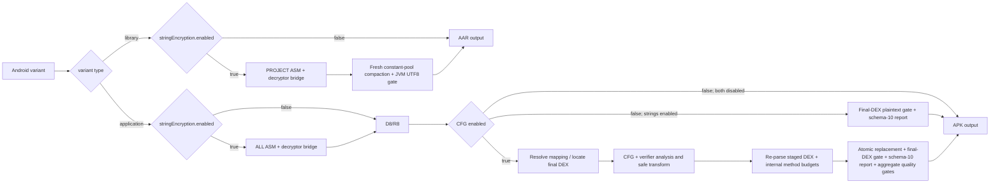

# DexCfgObfuscator Documentation

[Project home](../README.md) | [简体中文](README_CN.md)

## 1. Overview

DexCfgObfuscator is an Android string-obfuscation and DEX control-flow Gradle plugin with two
independent stages:

- Before D8/R8, it uses ASM to rewrite selected strings and generates a runtime decryption bridge.
  An application uses AGP `InstrumentationScope.ALL`, so matching classes from the app, local
  modules, and external AAR/JAR dependencies are processed automatically. A standalone Android
  library uses `InstrumentationScope.PROJECT` for its own classes.
- After an application's final DEX has been produced and before APK/AAB packaging, it applies
  control-flow transforms, structural verification, and reporting to explicitly selected business
  package or class prefixes.

Applying the plugin to an application is therefore sufficient for its packaged dependency graph:
dependency classes that match `packages` and do not match `excludePackages` require no separate
per-library configuration. Apply the plugin to a library itself only when that AAR must be protected
as an independently published artifact.

The project is designed to increase the cost of recovering linear control flow with static-analysis
tools such as JADX and JEB while prioritizing ART verifier correctness and runtime semantics. All
processing takes place in the local build. The plugin itself does not upload source code, DEX files,
R8 mappings, or reports.

It is not:

- A class, method, or resource name obfuscator; R8/ProGuard still owns those transformations.
- Secret storage for server credentials, API secrets, passwords, or private keys. Ciphertext, keys,
  and the decryptor ship in the client, and plaintext necessarily exists at runtime.
- DRM or an absolute anti-reversing solution. The built-in string stage cannot be enabled together
  with StringFog.
- A guarantee that AI systems or human analysts cannot understand the application.

Current coordinates:

| Item | Value |
|---|---|
| Gradle Plugin ID | `com.hunter.dexcfgobf` |
| Group | `com.hunter` |
| Version | `0.0.14` |
| Java | 17 |
| Current development baseline | Gradle 9.6.1, AGP 9.3.1 |
| DEX implementation | `com.android.tools.smali:smali-dexlib2:3.0.9` |

## Quick integration (start here)

The following **Groovy DSL** walkthrough is the shortest complete integration path. It covers the
project-level `settings.gradle`, the root `build.gradle`, and the Android module's `build.gradle`.
Kotlin DSL, custom algorithms, quality gates, and the complete library behavior remain documented in
the later “Obtaining the plugin,” “Consumer integration,” and “DSL reference” sections.

### Step 1: prepare the local Maven repository

Download and extract `dex-cfg-obfuscator-0.0.14-maven-repo.zip`. The consumer must point at the
extracted `maven-repo/` directory; copying only the implementation JAR is not sufficient:

```text
workspace/
├── YourAndroidApp/
│   ├── settings.gradle
│   └── build.gradle
└── DexCfgObfuscator/
    └── maven-repo/
```

DexCfgObfuscator may instead be a Git submodule under the consumer's `external/` or `tools/`
directory.

### Step 2: register the plugin repository in project-level `settings.gradle`

`pluginManagement` must be the first block in `settings.gradle`, and it must resolve both the
implementation publication and the Gradle plugin marker. If the project already has a
`pluginManagement` block, merge the `maven` repository below into it instead of creating a second
block:

```groovy
pluginManagement {
    def dexObfRepo = providers.gradleProperty('dexCfgObfuscatorRepo')
            .getOrElse('../DexCfgObfuscator/maven-repo')
    def repoFile = file(dexObfRepo)
    if (!repoFile.isAbsolute()) {
        repoFile = new File(rootDir, dexObfRepo)
    }

    repositories {
        maven {
            name = 'DexCfgObfuscatorLocalRepo'
            url = uri(repoFile)
        }
        gradlePluginPortal()
        google()
        mavenCentral()
    }
}
```

If developer machines use different locations, override the path in the consumer's
`gradle.properties`:

```properties
dexCfgObfuscatorRepo=/absolute/path/to/DexCfgObfuscator/maven-repo
```

### Step 3: declare the plugin version in the root `build.gradle`

Keep the consumer's existing Android plugins and versions, and add only the line below. Use
`apply false` at project level so the root project does not attempt an Android bytecode transform:

```groovy
plugins {
    // Keep the existing Android/Kotlin plugin declarations here.
    id 'com.hunter.dexcfgobf' version '0.0.14' apply false
}
```

If versions are not managed in the root project, the module may instead use
`id 'com.hunter.dexcfgobf' version '0.0.14'`. Choose one version-management style; do not declare
conflicting versions in both locations.
If the root script does not already contain `plugins {}`, place the new block after any existing
`buildscript {}` block and before other ordinary configuration blocks.

### Step 4: apply and configure the application module

This configuration protects strings in both Debug and Release while running DEX CFG only for
Release. Package selectors use prefix matching; replace them with business packages that you own and
have regression-tested:

```groovy
import com.hunter.dexcfgobf.gradle.ObfuscationLevel
import com.hunter.dexcfgobf.string.StringEncryptionMode

plugins {
    id 'com.android.application'
    id 'com.hunter.dexcfgobf'
}

dexControlFlowObfuscator {
    // Controls only the application's post-DEX CFG stage.
    enabled true
    enabledVariants = ['release']
    level ObfuscationLevel.MEDIUM

    obfClass = ['com.example.app']
    blackClass = [
            'com.example.app.generated',
            'com.example.app.bootstrap'
    ]

    stringEncryption {
        // Independent of the outer enabled switch. Application scope is ALL, including matching
        // classes from local modules and external AAR/JAR dependencies.
        enabled true
        mode StringEncryptionMode.BYTES
        packages = ['com.example.app']
        excludePackages = ['com.example.app.databinding']
    }
}
```

For string protection without CFG, set the outer `enabled` property to `false`; the inner
`stringEncryption.enabled true` remains effective. Coverage, plaintext, unsafe-skip, minimum-count,
and decryptor-CFG gates already use secure defaults. A Release build must use `--rerun-tasks` so the
default full-coverage gate sees a complete ASM traversal; advanced overrides are documented later.

### Step 5 (optional): protect a standalone Android library artifact

Skip this step when the library is consumed only by the application configured in Step 4: the
application's `ALL` scope already processes matching classes from local modules and external
AAR/JAR dependencies. Apply the plugin to a library only when its AAR must leave the library build
already protected. A standalone library intentionally uses `PROJECT` scope:

```groovy
import com.hunter.dexcfgobf.string.StringEncryptionMode

plugins {
    id 'com.android.library'
    id 'com.hunter.dexcfgobf'
}

dexControlFlowObfuscator {
    // A library has no post-DEX CFG task; configure only its own string scope here.
    enabled false
    stringEncryption {
        enabled true
        mode StringEncryptionMode.BYTES
        packages = ['com.example.security']
        excludePackages = ['com.example.security.databinding']
    }
}
```

The optional `stringEncryption.enabledVariants` selector is available for standalone library
publishing; it is intentionally absent from the normal application setup. Legacy evidence merging
for project libraries that arrive pre-encrypted is documented only in the advanced compatibility
section.

### Step 6: build and inspect the report

Configuration cache must currently remain disabled when string protection is enabled. For final
Release validation, force the upstream transforms to execute so a cache-only build is not mistaken
for FULL coverage:

```bash
./gradlew :app:assembleRelease --rerun-tasks --no-configuration-cache
```

The application report is written to:

```text
app/build/reports/dex-cfg-obfuscator/release.json
```

To validate a library independently, run:

```bash
./gradlew :securityLibrary:bundleReleaseAar --rerun-tasks --no-configuration-cache
```

A library has no final application DEX and therefore does not emit the application's schema-10
JSON. Its class-pool compaction and JVM plaintext gate run before AAR packaging and report through
the build log.

At minimum, check `dexFailed=0`, `stringCoverageStatus=FULL`,
`stringPlaintextVerified=true`, and `stringPlaintextLeaks=0` in the build output and report. A
successful build proves only the local structural gates; test cold start, critical flows, and
application/library boundaries on the target Android versions before release.

## 2. Implemented capabilities

### 2.1 Pre-D8/R8 string protection

- Uses `ALL` scope for application variants, processing every matching app, local-module, external
  AAR, and external JAR class in the packaged dependency graph. Standalone Android library variants
  retain `PROJECT` scope for their own classes.
- Rewrites String `LDC` instructions. For supported `static final String` fields with a
  `ConstantValue`, it removes the plaintext constant and assigns the decrypted value in an existing
  or generated `<clinit>`.
- Generates `<namespace>.DexStringDecryptor_<projectHash>` by default. The stable project-path suffix
  prevents duplicate classes when an app and library share a namespace; `bridgeClass` can rename it.
- Includes a deterministic per-site key generator and reversible stream transform, while allowing
  applications to supply their own build-time cipher, runtime decryptor, and key generator.
- Supports `BYTES` and `BASE64` carriers. Decrypted results are interned to preserve Java string
  literal identity semantics.
- Automatically excludes the generated bridge, the configured runtime implementation,
  `BuildConfig`, and `R`/`R2` classes. Empty or whitespace-only values, values larger than
  `maxStringBytes`, unpaired-surrogate values, and values rejected by
  `shouldEncrypt`/`shouldFog` remain unchanged.
- By default, verifies `decrypt(encrypt(value, key), key)` for every transformed constant and rejects
  identity ciphertext whose bytes equal the original UTF-8 bytes. A key exactly equal to plaintext is
  always rejected, and a complete plaintext sequence of at least eight bytes may not be embedded
  verbatim in either the key or ciphertext carrier.
- For applications, scans final DEX runtime string payloads: `const-string`, static String initial
  values, recursively encoded annotation String values, and referenced non-structural call-site
  names/arguments. Selected
  plaintext still present in those payloads fails the build. Whole-pool matches remain diagnostic so
  class/member/debug/record names do not create false leak failures; `strictWholeStringPool true`
  restores the old any-match gate. Schema-10 JSON contains no plaintext, plaintext hash, ciphertext,
  or key. An APK necessarily carries ciphertext, key carriers, and the runtime bridge; the gate proves
  absence of selected plaintext from the defined final-DEX runtime payloads, not absence of recovery
  material. Checksummed local evidence stores SHA-256 values, original member scopes, and statistics
  below `build/intermediates`; do not commit or distribute it.
- Before packaging a library AAR, rebuilds classes modified in the current transform with a fresh ASM
  constant pool, removing unreachable plaintext that an AGP-seeded writer may retain. It then checks
  runtime String payloads in every class file and class JAR discovered recursively below the
  transform outputs against SHA-256-only protected-value evidence. Raw `CONSTANT_Utf8` matches remain
  whole-pool diagnostics unless `strictWholeStringPool=true`.
- Dry-runs the complete JVM method before emission. If the conservative all-BYTES Code estimate
  exceeds 65,535 bytes, that whole method uses BASE64; the transform fails before class emission if
  the all-BASE64 plan also exceeds the limit. It never emits a partially mixed method.
- Unsupported executable strings and non-structural call-site names inside any
  `invokedynamic`/`ConstantDynamic` data fail closed by default instead of being silently exposed.
  Javac concat, lambda, and record call-site names are structural only after their complete compiler
  shape is validated; exact record-component metadata is handled likewise. Every
  `ConstantDynamic` name remains unsupported.

### 2.2 Variant and R8 integration

- Discovers Android application variants through `androidComponents.onVariants`.
- For non-minified debug variants, prefers `mergeProjectDex<Variant>`. If an application task graph
  exposes only `mergeDex<Variant>`, it safely falls back while still transforming only explicitly
  included classes.
- For minified release variants, runs after `minify<Variant>WithR8`.
- Reads the official `SingleArtifact.OBFUSCATION_MAPPING_FILE` and resolves source prefixes from
  `obfClass` to an exact set of post-R8 class names.
- Fails a minified release build if the mapping is missing or resolves no target classes.
- Supports `-repackageclasses` without opening the entire repackaged namespace to transformation.
- Selects the opcode table from each DEX header (`dex.035/037/038/039/040/041`) so `dex.039`
  `invoke-polymorphic` / `invoke-custom` instructions are not decoded as legacy odex quick opcodes.

### 2.3 Multi-region control-flow flattening

Methods that satisfy the strong-transform safety checks are split into basic blocks and distributed
across 2–4 independent regions according to the selected level:

- Every region owns a separate sparse-switch dispatcher.
- Regions use independent random 32-bit state keys and encoding constants.
- Cross-region transitions pass through randomized gateways.
- Real `return` and `throw` instructions retain their exit semantics.
- Branch and fall-through edges are rebuilt as explicit state transitions.

### 2.4 Split state registers

The flattened state is not kept in one long-lived, obvious register:

```text
state = shareA XOR shareB
```

- Both shares live in dedicated registers.
- The state is reconstructed only briefly before dispatch.
- A rolling route register is updated by trampolines.
- Original application registers are shifted; the strong template adds four registers.

### 2.5 Reachable equivalent paths

The plugin does not rely exclusively on branches that are provably never executed. Selected real
target blocks receive two semantically equivalent alias cases:

- Normal execution selects either alias according to route state.
- Both paths have similar shapes.
- Aliases modify dedicated route/state-share registers only.
- Both converge on the same real block without changing application registers or side effects.

The entry block also passes through an alias, making at least one interference path reachable in
normal execution.

### 2.6 Multiple state-encoding templates

Different methods, regions, and seeds select different reversible encoding shapes. The current
implementation includes eight encoder shapes combined with two route-update styles. Reports contain
template names such as:

```text
regional-shared-route-add-add-xor
regional-shared-route-xor-xor-add-xor
```

These encodings create structural variation; they are not cryptographic protection.

### 2.7 Original-switch hardening

On a safe path, an original packed or sparse switch is transformed as follows:

- A dedicated scratch register is allocated without overwriting the original selector.
- Original case keys pass through `XOR → odd multiply → ADD → XOR` encoding.
- Consecutive keys become random signed 32-bit sparse keys.
- Many fake cases are mixed with real cases using similarly shaped trampolines.
- A second char dispatcher favors visible ASCII keys such as `!`, `@`, and `~`.
- Fake cases converge on the original default path without application side effects.

Target case counts per switch:

| Level | Target cases | Per-method cumulative case budget |
|---|---:|---:|
| `LOW` | 12–24 | 48 |
| `MEDIUM` | 50–80 | 160 |
| `HIGH` | 80–95 | 240 |

Decompiler rendering is not a stable API. JADX or JEB may still render character-range keys as
decimal integers.

### 2.8 Basic-block reordering and payload relocation

Methods that cannot use the strong template can use conservative physical block reordering:

- The real CFG is preserved while linear instruction layout is shuffled.
- Fall-through edges receive explicit goto instructions.
- dexlib2 labels rebind branch targets.
- Tail `fill-array-data`, packed-switch, and sparse-switch payloads are extracted, aligned, and
  relocated.
- dexlib2 widens `GOTO → GOTO_16 → GOTO_32` when necessary.

### 2.9 try/catch support

try/catch support is enabled by default and does not require a host option:

- try ranges, catch types, and handlers are preserved and rebuilt.
- `move-exception` remains at a valid handler entry.
- Verifier-sensitive methods prefer the reorder path that does not introduce new CFG joins.
- A method is preserved or falls back when safety cannot be established.

### 2.10 Verifier type analysis and register separation

The plugin analyzes verifier types and register live ranges. If one source vreg stores a `String`,
array, object, or integer in separate non-overlapping lifetimes, those lifetimes can be assigned to
different physical registers before the strong transform is attempted.

Conservative fallback occurs when:

- Complex phi copies would be required.
- invoke-range contiguity cannot be preserved.
- Wide and narrow lifetimes conflict.
- Uninitialized-object or monitor semantics are risky.
- An instruction format cannot encode the shifted register number.

### 2.11 Staged verification, atomic replacement, and variant quality gates

Every DEX is copied to a staging directory outside the producer directory:

1. Transform the staged DEX.
2. Serialize and parse it again.
3. Check register ranges, wide registers, branch targets, and short-branch distances.
4. Check switch/array payload alignment, orphan payloads, and illegal payload entry.
5. Check `move-exception`, handlers, try-range ordering, and overlap.
6. Enforce per-method structural/code-unit budgets.
7. Replace producer DEX files only after every staged file succeeds.
8. Restore backups if the commit fails partway through.

After every producer directory has either current or artifact-bound cached evidence, the plugin
writes the schema-10 report and enforces `minObfuscatedMethods`, `minFlattenedMethods`,
`minObfuscatedRatio`, and `maxSizeIncreasePercent` once against the **variant-aggregate** statistics.
This keeps fresh/cached and multi-directory builds consistent. Before any fresh CFG rewrite, a
variant-wide transaction snapshots every candidate DEX plus each writable evidence, state, pending,
and report file. Any caught later quality, string, plaintext, adversarial, or evidence failure restores
the complete pre-task artifact set. An abrupt process termination remains fail-closed through the
pending marker and requires a clean `--rerun-tasks` build.

This is a local structural gate. It does not replace ART verification or application regression tests
on real devices.

### 2.12 Post-transform method budgets

In addition to the input `maxInstructions` check, the plugin checks final DEX code units and resolved
branch distances. Current internal limits are implementation details and may change:

| Level | Maximum code units | Minimum allowance | Maximum growth factor |
|---|---:|---:|---:|
| `LOW` | 12,000 | 4,096 | 64× |
| `MEDIUM` | 20,000 | 8,192 | 128× |
| `HIGH` | 28,000 | 12,000 | 192× |

When a limit is exceeded, the plugin abandons the strong template or switch padding and attempts
plain block reordering.

## 3. Pipeline



Libraries have no final application DEX, so the plugin does not register the post-DEX CFG task for
them. Their gate covers only the pre-packaging AAR transform class outputs. The consuming application
module remains responsible for final-DEX control-flow protection and global plaintext proof.

## 4. Obtaining the plugin

### 4.1 Release ZIP (recommended for external consumers)

The distribution is not a standalone copied JAR. It is a directory-style Maven repository that
contains the implementation JAR, POM metadata, Gradle plugin marker, and checksums:

```text
dex-cfg-obfuscator-0.0.14-maven-repo.zip
└── maven-repo/
    └── com/hunter/...
```

Extract it to a stable location and point the consuming build at `maven-repo/`.

### 4.2 Clone or Git submodule

A sibling layout is simple and portable:

```text
workspace/
├── YourAndroidApp/
└── DexCfgObfuscator/
    └── maven-repo/
```

The repository can also be a submodule under `tools/` or `external/`; only the configured repository
path matters.

### 4.3 Publish from source

```bash
cd DexCfgObfuscator
./gradlew clean test validatePlugins publish
```

`publish` writes both the implementation publication and plugin marker into this repository's
`maven-repo/` directory.

## 5. Consumer integration

### 5.1 Groovy `settings.gradle`

```groovy
pluginManagement {
    def dexObfRepo = providers.gradleProperty("dexCfgObfuscatorRepo")
            .getOrElse("../DexCfgObfuscator/maven-repo")
    def repoFile = file(dexObfRepo)
    if (!repoFile.isAbsolute()) {
        repoFile = new File(rootDir, dexObfRepo)
    }

    repositories {
        maven {
            name = "DexCfgObfuscatorLocalRepo"
            url = uri(repoFile)
        }
        gradlePluginPortal()
        google()
        mavenCentral()
    }
}
```

An absolute override can live in the consumer's `gradle.properties`:

```properties
dexCfgObfuscatorRepo=/absolute/path/to/DexCfgObfuscator/maven-repo
```

### 5.2 Kotlin `settings.gradle.kts`

```kotlin
pluginManagement {
    val configured = providers.gradleProperty("dexCfgObfuscatorRepo")
        .orElse("../DexCfgObfuscator/maven-repo")
        .get()
    val candidate = file(configured)
    val repoDir = if (candidate.isAbsolute) candidate else rootDir.resolve(configured)

    repositories {
        maven {
            name = "DexCfgObfuscatorLocalRepo"
            url = uri(repoDir)
        }
        gradlePluginPortal()
        google()
        mavenCentral()
    }
}
```

### 5.3 Groovy application module `build.gradle`

The module examples below assume that the root `build.gradle` already declares version `0.0.14`
with `apply false`. Add `version '0.0.14'` after the module plugin ID only when there is no
project-level declaration.

```groovy
import com.hunter.dexcfgobf.gradle.ObfuscationLevel
import com.hunter.dexcfgobf.string.StringEncryptionMode

plugins {
    id 'com.android.application'
    id 'com.hunter.dexcfgobf'
}

dexControlFlowObfuscator {
    enabled true
    // Optional: run CFG only for release. The independent string stage still handles its enabled variants.
    enabledVariants = ['release']
    level ObfuscationLevel.MEDIUM

    // Prefix matching. Target only application code that you own and test.
    obfClass = [
            'com.example.app',
            'com.example.security'
    ]

    // Exclude bootstrap, generated, very large, or temporarily unsupported areas.
    blackClass = [
            'com.example.app.bootstrap',
            'com.example.app.generated'
    ]

    minObfuscatedMethods = 100
    // Counts only strong flattening; safely reordered methods do not satisfy this gate.
    minFlattenedMethods = 50
    minObfuscatedRatio = 0.30
    maxSizeIncreasePercent = 50

    stringEncryption {
        // Independent of the outer enabled switch. Application scope is ALL, so these prefixes
        // also select matching classes from local modules and external AAR/JAR dependencies.
        enabled true
        mode StringEncryptionMode.BYTES
        packages = ['com.example.app', 'com.example.security']
        excludePackages = ['com.example.app.databinding']
    }
}
```

Those four string properties are the normal setup. The plugin already defaults to at least one
encrypted string and modified class, zero unsafe or custom-filter skips, final-DEX plaintext
verification, protected decryptor coverage when CFG is enabled, and complete Release coverage.
Run Release with `--rerun-tasks`; override a gate only for a deliberately baselined exception.

### 5.4 Kotlin application module `build.gradle.kts`

```kotlin
import com.hunter.dexcfgobf.gradle.ObfuscationLevel
import com.hunter.dexcfgobf.string.StringEncryptionMode

plugins {
    id("com.android.application")
    id("com.hunter.dexcfgobf")
}

dexControlFlowObfuscator {
    enabled = true
    level = ObfuscationLevel.MEDIUM
    obfClass = listOf("com.example.app", "com.example.security")
    blackClass = listOf("com.example.app.bootstrap", "com.example.app.generated")
    minFlattenedMethods = 50 // safely reordered methods do not count
    stringEncryption {
        enabled = true
        mode = StringEncryptionMode.BYTES
        packages = listOf("com.example.app", "com.example.security")
        excludePackages = listOf("com.example.app.databinding")
    }
}
```

### 5.5 Application with string protection only

The outer `enabled` property controls only the application's post-DEX CFG stage:

```groovy
dexControlFlowObfuscator {
    enabled false
    obfClass = ['com.example.app']
    stringEncryption {
        enabled true
    }
}
```

### 5.6 Android library module

An Android library can apply the same plugin, but only its pre-D8/R8 string stage runs. This is for
protecting a standalone AAR before publishing it. A consuming `0.0.14` application already uses
`ALL` scope and does not require the plugin on each library dependency.

```groovy
plugins {
    id 'com.android.library'
    id 'com.hunter.dexcfgobf'
}

dexControlFlowObfuscator {
    enabled false
    stringEncryption {
        enabled true
        // Advanced: publish only selected standalone-library variants. Empty means every variant.
        enabledVariants = ['release']
        mode StringEncryptionMode.BYTES
        packages = ['com.example.library']
        excludePackages = ['com.example.library.databinding']
    }
}
```

Inspecting rewritten call sites is insufficient because AGP's visitor writer may retain unreachable
entries from the original constant pool. At the end of `transform<Variant>ClassesWithAsm`, the plugin
rebuilds classes modified in the current transform with a fresh `ClassWriter`. The downstream
`compact<Variant>LibraryStringConstantPools` task then checks JVM LDC/ConstantValue, recursively
encoded annotation values, and invokedynamic/condy String names/arguments in every discovered output
class/class JAR. Raw `CONSTANT_Utf8` matches are also counted as whole-pool diagnostics;
`strictWholeStringPool=true` makes those matches fail. `sync<Variant>LibJars` and
`bundle<Variant>Aar` depend on that gate.

Because compaction mutates transform outputs in place, the plugin acquires an OS lock keyed by the
canonical library `buildDir` before `clean` or standard Android build work starts. The lock inode is
outside `buildDir` so `clean` cannot unlink it, and a Gradle Flow release runs only after all
scheduled build work (including failures) finishes. A concurrent process using the same absolute
`buildDir` fails fast; use an isolated `buildDir` instead of concurrent writers.

This verifies the **pre-packaging AAR transform class outputs**, not the packaged AAR itself and not
the consuming application's final DEX/APK/AAB. Release CI should still unpack the final AAR's
`classes.jar` and run the consuming application's final-DEX gate.

#### Legacy advanced compatibility: pre-encrypted project libraries

No dependency-evidence configuration is needed when the application is the only place where string
encryption runs: its `ALL` transform observes matching plaintext directly across the dependency
graph. Keep the following compatibility path only when a local Android library project has already
run its own `PROJECT` transform before the application consumes it. In that legacy layout, the app
merges the library's original member-scoped hashes so its final-DEX gate can still prove those
already encrypted values:

```groovy
stringEncryption {
    enabled true
    mode StringEncryptionMode.BYTES
    packages = ['com.example.app', 'com.example.legacy.library']
    excludePackages = ['com.example.app.databinding']

    // Legacy advanced compatibility only; the selected library variant must remain unminified.
    dependencyEvidenceProjects = [':legacyLibrary']
    dependencyEvidenceVariants = ['release']
}
```

These properties accept Gradle project paths, not arbitrary external AAR files. Prefer removing the
library-side transform and letting the application `ALL` scope perform one unified transform unless
the library must also be distributed as a protected standalone artifact.

| Legacy property | Default | Compatibility purpose |
|---|---|---|
| `dependencyEvidenceProjects` | `[]` | Unminified Android library project paths whose current member-scoped evidence is merged into the application final-DEX gate |
| `dependencyEvidenceVariants` | `[]` | Variant/build-type selectors for that merge; empty means every variant |

### 5.7 Build

Version `0.0.14` still performs an in-place post-processing step on the DEX producer output. It
records the content fingerprint of every successfully transformed DEX directory. A consecutive
incremental build skips an exact post-transform match, while changed or regenerated DEX is processed
normally. Keep `--rerun-tasks` on release builds so the default full-coverage gate sees every class
in the current invocation. `clean` may be added, but does not replace that flag:

```bash
./gradlew :app:assembleRelease --rerun-tasks --no-configuration-cache
# optional clean build
./gradlew clean :app:assembleRelease --rerun-tasks --no-configuration-cache
```

To force upstream DEX regeneration:

```bash
./gradlew :app:assembleDebug --rerun-tasks --no-configuration-cache
```

Do not stop at a `SUCCESS` task result. Application CFG and application string-only builds write a
schema-10 report and run the final-DEX plaintext gate. Libraries run their separate pre-packaging
class-pool gate but have no final application DEX, so the packaged AAR and consuming application
artifact still need end-to-end inspection.

## 6. DSL reference

Only stable choices that the consumer must control are public. Structural verification, try/catch
support, type separation, payload relocation, multiple templates, and JSON reports remain enabled by
default.

| Property | Type | Default | Description |
|---|---|---|---|
| `enabled` | `boolean` | `true` | Controls only the application's post-DEX CFG stage, not string encryption |
| `enabledVariants` | `List<String>` | `[]` | Variant/build-type selectors for CFG; empty means every application variant and does not filter strings |
| `level` | `ObfuscationLevel` | `MEDIUM` | `LOW`, `MEDIUM`, or `HIGH` |
| `obfClass` | `List<String>` | `[]` | Package or class prefixes to process |
| `blackClass` | `List<String>` | `[]` | Prefixes appended to the built-in exclusions |
| `minObfuscatedMethods` | `int` | `0` | Variant-aggregate minimum CFG-obfuscated methods; zero disables the gate |
| `minFlattenedMethods` | `int` | `0` | Variant-aggregate minimum strongly flattened methods; reordered methods do not count, zero disables the gate |
| `minObfuscatedRatio` | `double` | `0.0` | Variant-aggregate minimum obfuscated/scanned method ratio in `[0,1]` |
| `maxSizeIncreasePercent` | `double` | `100.0` | Maximum variant-aggregate DEX-size growth percentage |
| `adversarialCommands` | `List<List<String>>` | `[]` | Optional external regression commands; not shell strings |
| `adversarialTimeoutSeconds` | `int` | `300` | Timeout for each external command |

`stringEncryption {}` is an independent pre-D8/R8 stage within the same plugin:

| Property | Default | Description |
|---|---|---|
| `enabled` | `false` | Enables string rewriting; application scope is `ALL`, standalone-library scope is `PROJECT`; `enable true` is accepted |
| `enabledVariants` | `[]` | Advanced variant/build-type selector, mainly for standalone library publishing; empty means every variant |
| `implementation` | `null` | Runtime Android decryptor FQCN; without `algorithm`, the build also instantiates this class |
| `algorithm` | `null` | Optional build-time cipher object; a matching runtime `implementation` is still required |
| `keyGenerator` / `kg` | built-in | Build-time key generator object or one/two-argument Groovy closure |
| `mode` | `BYTES` | `BYTES` or `BASE64`; `bytes`, `base64`, and `text` are accepted, with `text` mapped to `BASE64` |
| `packages` / `fogPackages` | omitted | Omitted (`null`) inherits `obfClass`; explicit `[]` disables inheritance and fails validation because no target package remains |
| `excludePackages` | omitted | Omitted (`null`) inherits `blackClass`; explicit `[]` means do not inherit CFG exclusions |
| `seed` | `0x6D0F27BD4A91C35E` | Deterministic built-in key-derivation seed; it is not a secret |
| `maxStringBytes` | `4096` | Per-literal UTF-8 plaintext limit; ciphertext and key also have bytecode budgets |
| `bridgeClass` | `<namespace>.DexStringDecryptor_<projectHash>` | Generated top-level bridge; the default is collision-safe across modules |
| `decryptorStatic` | `false` | Use a singleton implementation instance; `true` calls a static `decrypt` method |
| `verifyRoundTrip` | `true` | Verify each build-time encryption/decryption round trip |
| `allowIdentityCiphertext` | `false` | Allow ciphertext bytes equal to plaintext bytes; intended only for temporary diagnostics |
| `verifyFinalDex` | `true` | Check final application DEX runtime payloads and diagnose whole-pool matches |
| `strictWholeStringPool` | `false` | Also fail on matching class/member/debug metadata; default uses exact execution sites plus a global runtime fallback only for unresolved sites |
| `failOnPlaintextLeak` | `true` | Fail on a leak in the application DEX or library JVM constant-pool gate |
| `failOnUnsupportedStringConstants` | `true` | Fail on executable bootstrap strings or non-structural dynamic call-site names that cannot be safely rewritten |
| `minEncryptedStrings` | `1` | Minimum encrypted constants for a full snapshot |
| `minModifiedClasses` | `1` | Minimum classes modified by the string transform |
| `maxSkippedStrings` | `Integer.MAX_VALUE` | Maximum permitted skipped constants |
| `maxUnsafeSkippedStrings` | `0` | Maximum technical misses such as oversized or invalid-Unicode literals; zero fails closed |
| `maxFilteredStrings` | `0` | Maximum values intentionally rejected by custom `shouldEncrypt/shouldFog` logic |
| `failOnUnknownCoverage` | `true` | Fail when a selected variant cannot prove full string coverage |
| `failOnUnknownCoverageVariants` | `['release']` | Variant/build-type selectors for the previous gate; Release is strict by default |
| `failOnUnprotectedDecryptor` | `true` | With CFG enabled, fail when the bridge/runtime decryptor is outside CFG coverage |
| `configurationId` | `""` | Manual fingerprint input for custom object state not captured by class bytes or `toString()` |
| `debug` | `false` | Emit lifecycle logs with call-site location and byte sizes, never plaintext; does not select or gate variants |

For minified variants, every ordinary method that was successfully rewritten receives an internal
CLASS-retention site marker. A generated R8 rule allows shrinking and obfuscation but forbids
optimization of that method, so live sites retain a mappable boundary while dead sites may still be
removed. Libraries propagate the same rule as a consumer rule. A protected `static final String`
executes in `<clinit>()V`; the field relation is provenance only and is never reported as a final-DEX
field gate. The final verifier combines `mapping.txt`, `usage.txt`, `seeds.txt`, and actual DEX
presence: exact sites are scanned exactly, proven-removed sites do not invent targets, and only the
remaining unresolved hashes use a conservative all-DEX runtime-payload fallback. The JSON string
section contains classification counts, not string sites, plaintext, plaintext hashes, ciphertext, or
keys. The CFG `methods[]` section intentionally still contains DEX, owner, method name, and descriptor.
Local incremental evidence stores plaintext SHA-256 values and original member scopes and must remain
under `build/intermediates`.

`packages` and `excludePackages` inherit independently and only when omitted. In an application,
the resulting prefix filters are evaluated across the complete `ALL` class scope. For example,
`packages = []` does not mean “use `obfClass`,” and `excludePackages = []` intentionally allows the
string stage to ignore outer CFG exclusions.

### 6.1 Built-in algorithm and carrier modes

The default `ContextHashKeyGenerator` derives a 16-byte per-site key with
`SHA-256(seed, location, plaintext)`. `StreamXorStringCipher` drives a reversible XOR byte stream
with that key. Identical plaintext at different locations normally receives different key/ciphertext
pairs, and builds remain reproducible. This remains static obfuscation, not cryptographic secret
storage.

- `BYTES` prefers constructing `byte[]` values in method bodies, avoiding Base64 ciphertext strings
  at the cost of larger methods and DEX files. Before writing a method, the transform dry-runs an
  all-BYTES plan and, only when needed, an all-BASE64 plan. If the conservative BYTES Code estimate
  exceeds the limit, every protected value in that method uses the BASE64 bridge overload. A build
  configured for BYTES can therefore contain a few all-BASE64 methods, but never a partially mixed
  method; it fails explicitly if even that compact plan cannot fit.
- `BASE64` stores ciphertext and key as Base64 String constants, producing smaller bytecode and
  decoding them at runtime.

The generated bridge interns every decrypted result. This preserves common literal behavior such as
`value == "literal"`, although application tests should still avoid relying on reference identity.

### 6.2 Custom cipher and key generator

Custom classes do not implement a StringFog interface. The plugin discovers these build-time methods
by convention:

```java
public byte[] encrypt(String value, byte[] key);
public String decrypt(byte[] value, byte[] key);

// Optional; shouldFog(String) is accepted for migration compatibility.
public boolean shouldEncrypt(String value);
```

A key generator supports either shape:

```java
public byte[] generate(String value, String location);
// Legacy-compatible shape:
public byte[] generate(String value);
```

Typical Groovy configuration:

```groovy
stringEncryption {
    enabled true
    implementation 'com.example.security.CustomStringCipher'
    kg = new CustomKeyGenerator()
    mode StringEncryptionMode.BYTES
    fogPackages = ['com.example']
    excludePackages = []
}
```

The build-time implementation must be visible to the Gradle plugin classpath, commonly through
`buildSrc`; the Android source set must also contain the runtime decryptor. With only
`implementation` configured, both copies use the same FQCN and the build-time class must be
constructible. Alternatively, `algorithm = new BuildTimeCipher()` can separate the build-time object
from the runtime FQCN, but both sides must implement exactly the same algorithm. The runtime
`implementation` must be a public class with public `String decrypt(byte[], byte[])`. Instance mode
also requires a concrete public class, a public no-argument constructor, and a non-static `decrypt`;
neither the constructor nor `decrypt` may declare a checked exception. Static mode uses
`decryptorStatic true` and requires public static `decrypt`. When no separate `algorithm` is supplied,
the same build-time class must also expose public `encrypt` with staticness matching that mode. A
separate build-time `algorithm` object must expose the public conventional `encrypt/decrypt` methods.
Instance implementations must be deterministic across independently constructed objects and must not
depend on encrypt/decrypt call order. The plugin constructs a separate runtime verifier instance for
its round trip, including when a separate `algorithm` object is configured. Static mode cannot isolate
class state inside the same Gradle process, so static algorithms must not depend on process-random
state, mutable global state, or call order either.

Random key generators make builds non-reproducible. The transform digest always includes each custom
object's `toString()`. Without an override, `Object.toString()` identity safely prevents cross-build
cache reuse. Components that need stable cache reuse must override it with a deterministic value that
covers all relevant state; use `configurationId` to invalidate external configuration changes. Test
the generated bridge in an Android artifact as well.

### 6.3 Migrating from StringFog

1. Remove the old `stringfog` plugin, its top-level `stringfog {}` block, and its Gradle plugin
   classpath.
2. Move the configuration into
   `dexControlFlowObfuscator { stringEncryption { ... } }`.
3. Replace `StringFogMode` with `StringEncryptionMode`. `enable`, `fogPackages`, `kg`, and nested
   `stringFog {}` / `stringfog {}` are retained only as migration aliases.
4. Existing `encrypt`/`decrypt`/`shouldFog`/`generate` method shapes can remain, but `IStringFog` and
   `IKeyGenerator` interface dependencies are no longer required.
5. The legacy `StringFogIgnore` annotation is recognized on classes and methods. For a stable public
   filtering surface, prefer `packages`, `excludePackages`, or `shouldEncrypt`.
6. Do not reuse placeholder implementations whose `encrypt` returns the original UTF-8 bytes or
   whose `decrypt` returns `null`. Default reversibility and non-identity checks intentionally fail
   such builds; implement a real reversible non-identity transform instead of disabling validation.

Enabling this stage while the old StringFog plugin is applied fails fast to prevent double
instrumentation. The nested `stringFog {}` / `stringfog {}` aliases belong to DexCfgObfuscator and are not StringFog's
old top-level extension.

Built-in **CFG-stage** excluded prefixes:

```text
android/
androidx/
kotlin/
kotlinx/
com/google/
```

They are not silently applied to the string stage. The string stage automatically skips only the
generated bridge, configured runtime implementation, `BuildConfig`, `R`/`R2`, and explicit
`excludePackages`; `packages` and `excludePackages` inherit independently. All class lists use prefix
matching, not regular expressions. Prefer complete and precise package prefixes so that `com.foo`
does not unintentionally include `com.foobar`.

## 7. Obfuscation levels

| Level | Dispatcher regions | Alias target limit | Original-switch target cases | Intended use |
|---|---:|---:|---:|---|
| `LOW` | 2 | 4 targets / 8 alias cases | 12–24 | Size and build speed first |
| `MEDIUM` | 3 | 6 targets / 12 alias cases | 50–80 | Default balance |
| `HIGH` | 4 | 8 targets / 16 alias cases | 80–95 | Selected methods where size cost is acceptable |

The actual region and alias counts cannot exceed the method's available basic blocks. A higher level
does not force every method into the strong template; failed safety analysis still causes fallback or
skip.

## 8. Adversarial commands

`adversarialCommands` can run JADX, an internal verifier, or another regression tool after
obfuscation. Every command must be an argument array. The plugin invokes `ProcessBuilder` directly
without shell interpretation.

```groovy
dexControlFlowObfuscator {
    adversarialCommands = [[
            'tools/check-obfuscated-dex',
            '--dex-dir', '{dexDir}',
            '--report', '{report}',
            '--variant', '{variant}'
    ]]
    adversarialTimeoutSeconds = 300
}
```

Supported placeholders:

- `{dexDir}`: current DEX directory.
- `{report}`: current variant report.
- `{variant}`: variant name.

A timeout or non-zero exit fails the build.

## 9. JSON report

Default path:

```text
<module>/build/reports/dex-cfg-obfuscator/<variant>.json
```

The current schema version is `10`. Top-level data includes:

- `variant` and `seed`.
- `evidence`: proof source plus final-DEX, CFG-transform, and string-transform fingerprints. These
  digests do not contain business plaintext.
- `summary`: DEX counts, scanned/obfuscated/skipped methods, flatten/reorder counts, switch cases,
  aliases, dispatchers, state sharing, DEX-size growth, and these string-stage fields when the
  application runs the final DEX task:
  `stringEncryptionEnabled`, `stringEncryptionMode`, `stringClassesVisited`,
  `stringClassesModified`, `stringConstantsEncrypted`, `stringConstantsSkipped`, and
  `stringIdentityCiphertexts`; plus `stringCoverageStatus`, `stringUnsupportedConstants`, final-DEX
  verification state and gate mode, scanned DEX/string-pool counts, effective/runtime leak counts,
  whole-pool collision counts, and const/static/annotation/call-site scan counts. Plaintext hashes
  are not serialized.
- `skipReasons`: too small, too large, register budget, verifier analysis, unsupported, and
  already-obfuscated counts.
- `budgets`: coverage and size thresholds used by the build.
- `methods`: mode, reason, template, before/after instructions, code units, registers, try/switch/
  payload flags, and switch/dispatcher metrics for every method.

Examples:

```bash
jq '.summary' app/build/reports/dex-cfg-obfuscator/release.json
jq '.summary | {stringEncryptionEnabled,stringCoverageStatus,stringConstantsEncrypted,stringUnsupportedConstants,stringPlaintextVerified,stringPlaintextGateMode,stringPlaintextLeaks,stringRuntimePlaintextLeaks,stringWholePoolPlaintextCollisions}' \
  app/build/reports/dex-cfg-obfuscator/release.json
jq '.skipReasons' app/build/reports/dex-cfg-obfuscator/release.json
jq '.methods[] | select(.mode == "flattened") | {owner,name,template,dispatcherRegions}' \
  app/build/reports/dex-cfg-obfuscator/release.json
```

At minimum, CI should retain the report and compare:

- `dexFailed` must be zero.
- `methodsObfuscated` and `obfuscatedRatio` should not collapse unexpectedly.
- When `minFlattenedMethods` is configured, the variant-aggregate `methodsFlattened` must meet that baseline;
  `methodsReordered` does not count toward this gate.
- `sizeIncreasePercent` should not spike unexpectedly.
- `alreadyObfuscated` should be near zero in a pristine build.
- `stringConstantsEncrypted` should not collapse unexpectedly when string encryption is enabled.
- `stringIdentityCiphertexts` should normally be zero.
- A pristine release should report `stringCoverageStatus=FULL`, `stringPlaintextVerified=true`,
  `stringPlaintextLeaks=0`, and `stringUnsupportedConstants=0`.

Schema-10 JSON is written by application CFG and application string-only tasks. A library does not
write that application report; before AAR packaging it uses a separate class-pool gate and
checksummed internal evidence containing statistics, tracked SHA-256 values, the class-artifact
fingerprint, and the string-configuration digest. A library has no final application DEX to audit,
so end-to-end proof still belongs to the consuming application build.
`FULL` means the current build visited the complete ASM input; `CACHED_FULL` means complete,
artifact/config-bound evidence was restored and the relevant DEX or JVM UTF8 pools were scanned
again. Both can enforce
count gates. `PARTIAL_OR_FULL`, `CACHED_PARTIAL`, and `UNKNOWN_INCREMENTAL` require a
`--rerun-tasks` refresh. Release already enables the unknown-coverage failure by default. Missing,
corrupt, or mismatched evidence fails closed when the strict plaintext gate is enabled.

On a cached library path with no current ASM snapshot, evidence is accepted only when both the class
artifact fingerprint and configuration digest match. A non-`--rerun-tasks` transform may visit only
changed classes, so current hashes are conservatively unioned with compatible prior hashes. A
configuration change refuses that inheritance and requires a clean/`--rerun-tasks` build; a full
rerun resets the union. A first partial build without prior evidence remains non-`FULL`, so release CI
must use `--rerun-tasks`; the matching `failOnUnknownCoverage=true` Release policy is already the
default.

In application schema-10 JSON, `evidence.source` is `CURRENT_BUILD`, `CACHED_VERIFIED`, `MIXED`, `MISSING`, or
`PARTIAL_MISSING`. The last value means one enabled stage has proof while another does not; always
check `stringPlaintextVerified` and `stringCoverageStatus` as well. Before an in-place CFG rewrite,
the plugin writes a checksummed pre-image transaction marker. If DEX bytes changed but matching
evidence was not committed, the next build refuses to transform or relabel the artifact and requires
a clean rebuild. Cached CFG quality gates use current schema-10 statistics, but a new report is kept
only after every gate succeeds; on failure the variant transaction restores the prior report (or
deletes it if none existed). An OS file lock serializes the complete transaction per DEX directory.
The versioned, low-collision, register-free method marker is scanned artifact-wide, so changing the
include/exclude scope cannot bypass sidecar-loss refusal. The OS releases locks after process death;
the pending marker then decides whether retry is safe.

## 10. Validation guidance

### 10.1 Plugin tests

```bash
./gradlew clean test validatePlugins
```

The suite covers string cipher/key contracts, ASM rewriting, generated bridges, Unicode and static
fields, interpreted semantics, multiple seeds, try/catch, payloads, R8 mappings, verifier type
separation, structural verification, report accounting, and post-transform budgets. Library tests
also cover fresh constant-pool rebuilding, class/JAR discovery under output directories, resource
preservation, excluded-class runtime leaks, whole-pool diagnostics/strict mode, and refusal of unknown
attributes and signed JARs.

### 10.2 Consumer builds

```bash
./gradlew :app:assembleDebug --rerun-tasks --no-configuration-cache
./gradlew :app:assembleRelease --rerun-tasks --no-configuration-cache
```

For a library, inspect the produced AAR's `classes.jar`. For applications, scan the final APK/AAB,
not only pre-R8 class files. Use unique test literals that are safe to expose in CI and verify that:

- Their plaintext bytes are absent from the protected `classes.jar` or final DEX.
- Call sites invoke the generated decryptor (or an R8-inlined equivalent).
- `static final String` fields no longer carry plaintext `ConstantValue` entries.
- The runtime value, Unicode/NUL handling, and any intentional `intern()` identity behavior remain
  correct.
- `stringIdentityCiphertexts` is zero unless identity mode was explicitly allowed for diagnostics.

Use both a raw byte scan and `javap -v` on an unpacked `classes.jar`; checking only executable method
semantics can miss plaintext that is unreachable but still present in the JVM constant pool.

### 10.3 Decompiler regression

Use the JADX/JEB versions supported by your project and verify that:

- The APK can still be opened.
- Protected plaintext test literals are absent while decrypt calls, byte arrays, or Base64 carriers
  remain reachable.
- Selected methods contain regional dispatch, random cases, aliases, or safe block reordering.
- Original switch case counts changed as expected.
- A decompiler error is not the only success criterion; runtime semantics and surviving CFG
  complexity matter more.
- Attempt an offline recovery script from the generated bridge and ciphertext/key carriers. The
  built-in algorithm and keys ship in the artifact, so recovery after JADX without running the app is
  an explicit security boundary, not evidence that the transform failed; record the recovery steps
  and cost instead.

### 10.4 ART and real-device validation

Cover at least the minimum, common, and latest Android versions supported by the application:

```bash
adb install -r path/to/app-release.apk
adb shell am force-stop com.example.app
adb shell monkey -p com.example.app 1
```

Where supported, also run:

```bash
adb shell cmd package compile -m verify -f com.example.app
```

Inspect logcat for `VerifyError`, `Rejecting class`, `verification failed`, and `FATAL EXCEPTION`, then
run critical business flows. A successful build or install alone is not runtime proof.

## 11. Creating a distribution

```bash
chmod +x build-release.sh
./build-release.sh
```

The script:

1. Runs `clean test validatePlugins`.
2. Publishes to this repository's `maven-repo/`.
3. Verifies the implementation JAR and Gradle plugin marker.
4. Packages `maven-repo/`, the root README, and both language documents.
5. Writes a SHA-256 checksum file.

Consumers extract the ZIP, add its `maven-repo/` to `pluginManagement.repositories`, and apply the
same version. `mavenLocal()` is not required.

## 12. Troubleshooting

### 12.1 `Plugin ... was not found`

Check that:

- The Maven URL points to the extracted `maven-repo/`, not the ZIP or JAR.
- `pluginManagement.repositories` is in `settings.gradle(.kts)`.
- The marker directory contains `com.hunter.dexcfgobf.gradle.plugin-<version>.pom`.
- The requested version matches the version directory in the repository.

### 12.2 Missing release mapping

The minified release path requires the R8 mapping. Check that:

- The variant with `minifyEnabled true` actually runs R8.
- No custom task removes or relocates the mapping.
- `obfClass` contains pre-R8 source class names.

### 12.3 `R8 mapping resolved zero included classes`

`obfClass` did not match application classes, or every match was excluded by `blackClass` or a
built-in prefix. Use a precise source package and inspect class names on the left side of the R8
mapping.

### 12.4 `fallback->reorder` in the log

This is an expected safety policy, not necessarily an error. Causes include registers that no longer
fit an instruction format, verifier ambiguity, range/wide constraints, or a method shape that is not
safe for the strong template. If `dexFailed=0` and runtime validation succeeds, the method used a more
conservative path.

### 12.5 `DEX size increase ... exceeds maxSizeIncreasePercent`

Variant-aggregate DEX growth exceeded the configured `maxSizeIncreasePercent` (default `100.0`).
The schema-10 report may have been refreshed before this gate fails, but the variant transaction
restores it together with all evidence/state/pending files and every fresh-directory DEX. The next
clean `--rerun-tasks` build starts again from the producer's original artifact. First:

- Look for `skip unchanged already-obfuscated DEX dir`; if it is absent and an old plugin may be in
  use, confirm that the host requests version `0.0.14`.
- Reduce `HIGH` to `MEDIUM` or `LOW`.
- Narrow `obfClass`.
- Exclude generated code with very large or numerous switches.

### 12.6 A second consecutive build grows unexpectedly

Version `0.0.14` still post-processes the producer output directory in place, but records checksummed
CFG evidence containing the directory fingerprint, transform digest, and statistics. It skips only
when current DEX bytes exactly match the evidenced post-transform fingerprint and the transform
digest also matches. Missing, corrupt, state-only, or mismatched evidence fails closed and asks for a
clean `--rerun-tasks` build. Regenerated or changed producer DEX causes a normal transformation,
preventing a consecutive build from padding original switches again.

When upgrading from `0.0.4`, run this once if the build directory already contains DEX processed by
the old version:

```bash
./gradlew :app:assembleRelease --rerun-tasks --no-configuration-cache
# or run clean first
```

A future integration should still use a stable AGP DEX artifact with explicit inputs and outputs,
removing the task-name and producer-directory adapter.

### 12.7 `stringEncryption requires packages/fogPackages`

The effective string include list is empty. Omit `packages`/`fogPackages` to inherit `obfClass`, or
set a non-empty string-specific list. An explicit `[]` intentionally disables inheritance and is not
treated as “all classes.”

### 12.8 Configuration-cache failure

The string stage keeps custom cipher/key objects as build-process state and does not yet support the
Gradle configuration cache. Run with `--no-configuration-cache`. The CFG-only stage can still be used
without enabling string encryption.

### 12.9 StringFog conflict

Remove the old `stringfog` plugin before enabling `stringEncryption`. DexCfgObfuscator refuses to
instrument the same classes twice. The nested `stringFog {}` / `stringfog {}` compatibility aliases do not apply the
old plugin.

### 12.10 Custom implementation cannot be constructed or round-trip verification fails

- Put a build-time copy on the Gradle plugin classpath, typically in `buildSrc`, or pass
  `algorithm = new BuildTimeCipher()`.
- Put the matching runtime implementation in the Android source set.
- In instance mode, use a concrete public class with a public no-argument constructor and public
  non-static `decrypt(byte[], byte[])`; neither may declare a checked exception. Otherwise use
  `decryptorStatic true` with public static `decrypt`.
- Ensure `encrypt` returns non-null `byte[]`, the key generator returns a non-null `byte[]`, and
  `decrypt(encrypt(value, key), key)` returns the exact original String.
- If `identity ciphertext` is reported, the algorithm returned plaintext bytes. Replace the
  placeholder algorithm rather than enabling `allowIdentityCiphertext` for release builds.

### 12.11 A known plaintext remains in the artifact

For an application, confirm that AGP includes the class in its `ALL` instrumentation input and that
the class matches `packages` without matching `excludePackages`; this applies equally to app, local
module, external AAR, and external JAR classes. For a standalone library build, only that library's
`PROJECT` classes are in scope. Resources, manifests, native binaries, annotations,
oversized/unpaired-surrogate strings, and strings synthesized after ASM are outside the supported
transform. Scan the final APK/AAB or AAR, because an earlier intermediate may legitimately contain
different content.

With `debug true`, lifecycle logs identify transformed call-site locations and byte sizes but never
print plaintext. This flag is diagnostic logging only and does not enable, disable, or select build
variants.

### 12.12 A custom algorithm changed but cached output was reused

The transform fingerprint includes component class bytes and an overridden `toString()`. If mutable
configuration lives elsewhere, change `configurationId`, then run a clean or `--rerun-tasks` build.
Use the clean-build schema-10 report as the release baseline; a cached incremental build may report
that string-encrypted classes were reused.

## 13. Known limitations

- String rewriting uses AGP `ALL` scope for applications and `PROJECT` scope for standalone Android
  libraries. Post-D8/R8 DEX CFG processing remains application-only.
- The AGP adapter still depends on producer task names and output directories instead of a standard
  post-R8 DEX artifact transform.
- Some short-register formats cannot encode shifted registers above v15 and therefore fall back.
- invoke-range, wide, monitor, uninitialized-object, and complex exception-edge methods may reorder
  or skip.
- Visible character cases depend on decompiler rendering.
- DEX size and startup/interpreter overhead grow with level, target methods, and original switches.
- String rewriting covers JVM `LDC` values and supported `static final String` ConstantValue fields,
  including those in dependency classes exposed by the application's `ALL` scope. It does not cover
  resources, manifests, native strings, annotation/Kotlin metadata values, or every String R8 may
  synthesize later. Artifact-wide gates catch such text only when it equals an
  already tracked protected value; metadata-only text that was never an encryption candidate has no
  hash and is neither rewritten nor discovered by that mechanism. Executable
  invokedynamic/ConstantDynamic bootstrap text and non-structural call-site names currently fail closed
  by default. Javac concat, lambda, and record call-site names are accepted only after their complete
  compiler shape is validated; Java-record component-name metadata must pass an exact
  `ObjectMethods.bootstrap` structural check. Every `ConstantDynamic` name remains unsupported.
  Disabling the unsupported-bootstrap gate reports but does not protect any other such text.
- Removing a public `static final String ConstantValue` preserves the field descriptor but changes
  Java source/compile-time-constant ABI. Consumer annotation attributes or `case` labels may stop
  compiling, while consumers built against an older/untransformed API may retain an inlined plaintext
  copy. Exclude these API constants or move them to an unprotected API module and run consumer builds.
- A protected `static final String` is assigned by a decrypt call at the beginning of the target
  class's `<clinit>`. Original initializer code runs after those assignments, but a custom decryptor
  (or its own class initialization) must not re-enter the target class and read another protected
  static field before assignment; JVM same-thread initialization re-entry can observe the default
  value. The built-in decryptor has no dependency on business classes, and custom implementations
  should preserve that one-way dependency.
- Library compaction recursively discovers classes and class JARs below transform-output directories
  and scans direct class entries in each JAR; it does not recursively unpack archives embedded as JAR
  resources. A class that needs rebuilding but contains an unknown ASM attribute is refused because
  that attribute may retain stale constant-pool indexes; semantic verification also refuses unknown
  attributes in any scanned class because they may hide JVM payloads. A signed JAR that would need
  rewriting is also refused and left unchanged rather than silently invalidating its `META-INF`
  signatures.
- `BYTES` mode can significantly enlarge methods and DEX payloads. Based on a conservative complete
  JVM method budget, each affected method falls back as a whole to BASE64; carriers are never mixed
  within that method. If neither whole-method plan fits, the transform fails before writing the
  class. Values over `maxStringBytes` are skipped.
- Keys and decryptor code ship in the artifact, plaintext exists at runtime, and this mechanism is
  not suitable for secret storage.
- Custom build-time and Android runtime implementation copies can drift; round-trip verification
  alone cannot prove that the runtime copy is identical.
- String encryption currently requires `--no-configuration-cache`.
- The application DEX gate fails by default only when a tracked value remains in a `const-string`,
  static String initial value, annotation value, or referenced non-structural call-site name/argument.
  The library JVM gate uses LDC/ConstantValue, annotation values, and invokedynamic/condy String
  names/arguments. Equal
  class/member/source/debug/record names are whole-pool diagnostics, not effective leaks in either
  module type; `strictWholeStringPool=true` restores conservative artifact-wide absence. Set
  `failOnPlaintextLeak=false` only when explicitly accepting a warning-only bypass; libraries keep
  local evidence but do not emit application schema-10 JSON.
- Incremental evidence stores plaintext SHA-256 values (never plaintext) under `build/intermediates`.
  Someone who already has the local build directory can dictionary-test short/common strings, so do
  not commit or distribute that directory; `clean` removes the evidence.
- Partial incremental builds conservatively inherit hashes from compatible prior evidence;
  configuration changes refuse the union and a full rerun resets it. Without prior evidence, a first
  partial build remains non-`FULL`; Release fails that state by default, so use `--rerun-tasks` for
  its complete coverage proof.
- Dynamic-feature modules are not yet instrumented and audited end-to-end. The default strict
  plaintext gate rejects configured `dynamicFeatures` instead of claiming whole-bundle proof.
  Report-only mode may continue with a warning, but coverage remains non-`FULL`.
- Schema-10 JSON and final-DEX plaintext verification also run for application string-only variants.
  A library gate covers pre-packaging transform class outputs, not the packaged AAR or consuming
  application's final DEX, and therefore cannot provide global absence proof.
- Local structural checks do not replace ART, OEM ROM, performance, or business-flow testing.
- JADX can expose the bridge, ciphertext/key carriers, and built-in algorithm sufficiently for an
  offline decoder without running the app. Obfuscation does not prevent that recovery, dynamic
  debugging, runtime dumps, hooks, or targeted semantic analysis.

## 14. Repository layout

```text
DexCfgObfuscator/
├── build.gradle
├── build-release.sh
├── README.md
├── doc/
│   ├── README_CN.md
│   └── README_EN.md
├── maven-repo/                 # Directly consumable directory Maven repository
├── release/                    # Generated by build-release.sh; ignored by default
└── src/
    ├── main/groovy/com/hunter/dexcfgobf/
    │   ├── gradle/             # Gradle plugin and DSL
    │   ├── string/             # ASM transform, cipher/key contracts, generated bridge
    │   ├── CfgFlattener.java
    │   ├── ControlFlowFlattener.java
    │   ├── DexStructuralVerifier.java
    │   ├── VerifierTypeSeparator.java
    │   └── ...
    └── test/java/com/hunter/dexcfgobf/
```

## 15. Public-release checklist

The repository does not currently contain a `LICENSE`. Before public release, the project owner
should:

- Select and add a `LICENSE`.
- Add the real GitHub URL, issue tracker, and contribution process.
- Confirm that history, examples, and release artifacts contain no credentials, signing files, or
  private application data.
- Run `./build-release.sh` in a pristine clone.
- Verify the release ZIP SHA-256.
- Run debug/release, JADX, ART, and business-flow validation on both a minimal sample and a real app.

## 16. Contribution principles

- Correctness and safe fallback take priority over transform coverage.
- New transforms require semantic tests, DEX re-parse tests, and boundary cases.
- Avoid AGP internal APIs unless versions are isolated and a migration plan is documented.
- Do not put application package names, secrets, or private build assumptions in plugin defaults.
- Documentation must distinguish implemented features, planned work, and externally validated claims.
