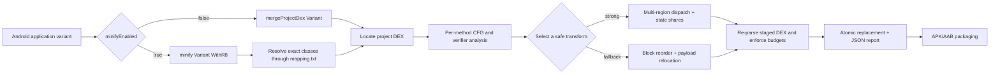

# DexCfgObfuscator Documentation

[Project home](../README.md) | [简体中文](README_CN.md)

## 1. Overview

DexCfgObfuscator is a DEX control-flow obfuscation Gradle plugin for Android application modules.
It runs after D8/R8 has produced the target DEX and before APK/AAB packaging, and it only processes
explicitly configured application package or class prefixes.

The project is designed to increase the cost of recovering linear control flow with static-analysis
tools such as JADX and JEB while prioritizing ART verifier correctness and runtime semantics. All
processing takes place in the local build. The plugin itself does not upload source code, DEX files,
R8 mappings, or reports.

It is not:

- A class, method, or resource name obfuscator; R8/ProGuard still owns those transformations.
- A string encryption tool; it can be combined with tools such as StringFog.
- Encryption, DRM, or an absolute anti-reversing solution.
- A guarantee that AI systems or human analysts cannot understand the application.

Current coordinates:

| Item | Value |
|---|---|
| Gradle Plugin ID | `com.hunter.dexcfgobf` |
| Group | `com.hunter` |
| Version | `0.0.5` |
| Java | 17 |
| Current development baseline | Gradle 9.6.1, AGP 9.3.1 |
| DEX implementation | `com.android.tools.smali:smali-dexlib2:3.0.9` |

## 2. Implemented capabilities

### 2.1 Variant and R8 integration

- Discovers Android application variants through `androidComponents.onVariants`.
- For non-minified debug variants, anchors after `mergeProjectDex<Variant>` and touches project DEX
  only.
- For minified release variants, runs after `minify<Variant>WithR8`.
- Reads the official `SingleArtifact.OBFUSCATION_MAPPING_FILE` and resolves source prefixes from
  `obfClass` to an exact set of post-R8 class names.
- Fails a minified release build if the mapping is missing or resolves no target classes.
- Supports `-repackageclasses` without opening the entire repackaged namespace to transformation.

### 2.2 Multi-region control-flow flattening

Methods that satisfy the strong-transform safety checks are split into basic blocks and distributed
across 2–4 independent regions according to the selected level:

- Every region owns a separate sparse-switch dispatcher.
- Regions use independent random 32-bit state keys and encoding constants.
- Cross-region transitions pass through randomized gateways.
- Real `return` and `throw` instructions retain their exit semantics.
- Branch and fall-through edges are rebuilt as explicit state transitions.

### 2.3 Split state registers

The flattened state is not kept in one long-lived, obvious register:

```text
state = shareA XOR shareB
```

- Both shares live in dedicated registers.
- The state is reconstructed only briefly before dispatch.
- A rolling route register is updated by trampolines.
- Original application registers are shifted; the strong template adds four registers.

### 2.4 Reachable equivalent paths

The plugin does not rely exclusively on branches that are provably never executed. Selected real
target blocks receive two semantically equivalent alias cases:

- Normal execution selects either alias according to route state.
- Both paths have similar shapes.
- Aliases modify dedicated route/state-share registers only.
- Both converge on the same real block without changing application registers or side effects.

The entry block also passes through an alias, making at least one interference path reachable in
normal execution.

### 2.5 Multiple state-encoding templates

Different methods, regions, and seeds select different reversible encoding shapes. The current
implementation includes eight encoder shapes combined with two route-update styles. Reports contain
template names such as:

```text
regional-shared-route-add-add-xor
regional-shared-route-xor-xor-add-xor
```

These encodings create structural variation; they are not cryptographic protection.

### 2.6 Original-switch hardening

On a safe path, an original packed or sparse switch is transformed as follows:

- A dedicated scratch register is allocated without overwriting the original selector.
- Original case keys pass through `XOR → odd multiply → ADD → XOR` encoding.
- Consecutive keys become random signed 32-bit sparse keys.
- Many fake cases are mixed with real cases using similarly shaped trampolines.
- A second char dispatcher favors visible ASCII keys such as `!`, `@`, and `~`.
- Fake cases converge on the original default path without application side effects.

Target case counts per switch:

| Level | Target cases | Per-method cumulative case budget |
|---|---:|---:|
| `LOW` | 12–24 | 48 |
| `MEDIUM` | 50–80 | 160 |
| `HIGH` | 80–95 | 240 |

Decompiler rendering is not a stable API. JADX or JEB may still render character-range keys as
decimal integers.

### 2.7 Basic-block reordering and payload relocation

Methods that cannot use the strong template can use conservative physical block reordering:

- The real CFG is preserved while linear instruction layout is shuffled.
- Fall-through edges receive explicit goto instructions.
- dexlib2 labels rebind branch targets.
- Tail `fill-array-data`, packed-switch, and sparse-switch payloads are extracted, aligned, and
  relocated.
- dexlib2 widens `GOTO → GOTO_16 → GOTO_32` when necessary.

### 2.8 try/catch support

try/catch support is enabled by default and does not require a host option:

- try ranges, catch types, and handlers are preserved and rebuilt.
- `move-exception` remains at a valid handler entry.
- Verifier-sensitive methods prefer the reorder path that does not introduce new CFG joins.
- A method is preserved or falls back when safety cannot be established.

### 2.9 Verifier type analysis and register separation

The plugin analyzes verifier types and register live ranges. If one source vreg stores a `String`,
array, object, or integer in separate non-overlapping lifetimes, those lifetimes can be assigned to
different physical registers before the strong transform is attempted.

Conservative fallback occurs when:

- Complex phi copies would be required.
- invoke-range contiguity cannot be preserved.
- Wide and narrow lifetimes conflict.
- Uninitialized-object or monitor semantics are risky.
- An instruction format cannot encode the shifted register number.

### 2.10 Pre-commit verification and atomic replacement

Every DEX is copied to a staging directory outside the producer directory:

1. Transform the staged DEX.
2. Serialize and parse it again.
3. Check register ranges, wide registers, branch targets, and short-branch distances.
4. Check switch/array payload alignment, orphan payloads, and illegal payload entry.
5. Check `move-exception`, handlers, try-range ordering, and overlap.
6. Enforce aggregate coverage and DEX-size budgets.
7. Replace producer DEX files only after every staged file succeeds.
8. Restore backups if the commit fails partway through.

This is a local structural gate. It does not replace ART verification or application regression tests
on real devices.

### 2.11 Post-transform method budgets

In addition to the input `maxInstructions` check, the plugin checks final DEX code units and resolved
branch distances. Current internal limits are implementation details and may change:

| Level | Maximum code units | Minimum allowance | Maximum growth factor |
|---|---:|---:|---:|
| `LOW` | 12,000 | 4,096 | 64× |
| `MEDIUM` | 20,000 | 8,192 | 128× |
| `HIGH` | 28,000 | 12,000 | 192× |

When a limit is exceeded, the plugin abandons the strong template or switch padding and attempts
plain block reordering.

## 3. Pipeline



## 4. Obtaining the plugin

### 4.1 Release ZIP (recommended for external consumers)

The distribution is not a standalone copied JAR. It is a directory-style Maven repository that
contains the implementation JAR, POM metadata, Gradle plugin marker, and checksums:

```text
dex-cfg-obfuscator-0.0.5-maven-repo.zip
└── maven-repo/
    └── com/hunter/...
```

Extract it to a stable location and point the consuming build at `maven-repo/`.

### 4.2 Clone or Git submodule

A sibling layout is simple and portable:

```text
workspace/
├── YourAndroidApp/
└── DexCfgObfuscator/
    └── maven-repo/
```

The repository can also be a submodule under `tools/` or `external/`; only the configured repository
path matters.

### 4.3 Publish from source

```bash
cd DexCfgObfuscator
./gradlew clean test validatePlugins publish
```

`publish` writes both the implementation publication and plugin marker into this repository's
`maven-repo/` directory.

## 5. Consumer integration

### 5.1 Groovy `settings.gradle`

```groovy
pluginManagement {
    def dexObfRepo = providers.gradleProperty("dexCfgObfuscatorRepo")
            .getOrElse("../DexCfgObfuscator/maven-repo")
    def repoFile = file(dexObfRepo)
    if (!repoFile.isAbsolute()) {
        repoFile = new File(rootDir, dexObfRepo)
    }

    repositories {
        maven {
            name = "DexCfgObfuscatorLocalRepo"
            url = uri(repoFile)
        }
        gradlePluginPortal()
        google()
        mavenCentral()
    }
}
```

An absolute override can live in the consumer's `gradle.properties`:

```properties
dexCfgObfuscatorRepo=/absolute/path/to/DexCfgObfuscator/maven-repo
```

### 5.2 Kotlin `settings.gradle.kts`

```kotlin
pluginManagement {
    val configured = providers.gradleProperty("dexCfgObfuscatorRepo")
        .orElse("../DexCfgObfuscator/maven-repo")
        .get()
    val candidate = file(configured)
    val repoDir = if (candidate.isAbsolute) candidate else rootDir.resolve(configured)

    repositories {
        maven {
            name = "DexCfgObfuscatorLocalRepo"
            url = uri(repoDir)
        }
        gradlePluginPortal()
        google()
        mavenCentral()
    }
}
```

### 5.3 Groovy application module `build.gradle`

```groovy
import com.hunter.dexcfgobf.gradle.ObfuscationLevel

plugins {
    id 'com.android.application'
    id 'com.hunter.dexcfgobf' version '0.0.5'
}

dexControlFlowObfuscator {
    enabled true
    level ObfuscationLevel.MEDIUM

    // Prefix matching. Target only application code that you own and test.
    obfClass = [
            'com.example.app',
            'com.example.security'
    ]

    // Exclude bootstrap, generated, very large, or temporarily unsupported areas.
    blackClass = [
            'com.example.app.bootstrap',
            'com.example.app.generated'
    ]
}
```

### 5.4 Kotlin application module `build.gradle.kts`

```kotlin
import com.hunter.dexcfgobf.gradle.ObfuscationLevel

plugins {
    id("com.android.application")
    id("com.hunter.dexcfgobf") version "0.0.5"
}

dexControlFlowObfuscator {
    enabled = true
    level = ObfuscationLevel.MEDIUM
    obfClass = listOf("com.example.app", "com.example.security")
    blackClass = listOf("com.example.app.bootstrap", "com.example.app.generated")
}
```

### 5.5 Build

Version `0.0.5` still performs an in-place post-processing step on the DEX producer output. It
records the content fingerprint of every successfully transformed DEX directory. A consecutive
incremental build skips an exact post-transform match, while changed or regenerated DEX is processed
normally. A clean build remains useful as a final release verification:

```bash
./gradlew :app:assembleRelease --rerun-tasks
# or
./gradlew clean :app:assembleRelease
```

To force upstream DEX regeneration:

```bash
./gradlew :app:assembleDebug --rerun-tasks
```

Do not stop at a `SUCCESS` task result. Check for `dexFailed=0` in the log and inspect the JSON
report.

## 6. DSL reference

Only stable choices that the consumer must control are public. Structural verification, try/catch
support, type separation, payload relocation, multiple templates, and JSON reports remain enabled by
default.

| Property | Type | Default | Description |
|---|---|---|---|
| `enabled` | `boolean` | `true` | Master switch for all application variants |
| `level` | `ObfuscationLevel` | `MEDIUM` | `LOW`, `MEDIUM`, or `HIGH` |
| `obfClass` | `List<String>` | `[]` | Package or class prefixes to process |
| `blackClass` | `List<String>` | `[]` | Prefixes appended to the built-in exclusions |
| `adversarialCommands` | `List<List<String>>` | `[]` | Optional external regression commands; not shell strings |
| `adversarialTimeoutSeconds` | `int` | `300` | Timeout for each external command |

Built-in excluded prefixes:

```text
android/
androidx/
kotlin/
kotlinx/
com/google/
```

`obfClass` and `blackClass` use prefix matching, not regular expressions. Prefer complete and precise
application package prefixes so that `com.foo` does not unintentionally include `com.foobar`.

## 7. Obfuscation levels

| Level | Dispatcher regions | Alias target limit | Original-switch target cases | Intended use |
|---|---:|---:|---:|---|
| `LOW` | 2 | 4 targets / 8 alias cases | 12–24 | Size and build speed first |
| `MEDIUM` | 3 | 6 targets / 12 alias cases | 50–80 | Default balance |
| `HIGH` | 4 | 8 targets / 16 alias cases | 80–95 | Selected methods where size cost is acceptable |

The actual region and alias counts cannot exceed the method's available basic blocks. A higher level
does not force every method into the strong template; failed safety analysis still causes fallback or
skip.

## 8. Adversarial commands

`adversarialCommands` can run JADX, an internal verifier, or another regression tool after
obfuscation. Every command must be an argument array. The plugin invokes `ProcessBuilder` directly
without shell interpretation.

```groovy
dexControlFlowObfuscator {
    adversarialCommands = [[
            'tools/check-obfuscated-dex',
            '--dex-dir', '{dexDir}',
            '--report', '{report}',
            '--variant', '{variant}'
    ]]
    adversarialTimeoutSeconds = 300
}
```

Supported placeholders:

- `{dexDir}`: current DEX directory.
- `{report}`: current variant report.
- `{variant}`: variant name.

A timeout or non-zero exit fails the build.

## 9. JSON report

Default path:

```text
<module>/build/reports/dex-cfg-obfuscator/<variant>.json
```

The current schema version is `3`. Top-level data includes:

- `variant` and `seed`.
- `summary`: DEX counts, scanned/obfuscated/skipped methods, flatten/reorder counts, switch cases,
  aliases, dispatchers, state sharing, and DEX-size growth.
- `skipReasons`: too small, too large, register budget, verifier analysis, unsupported, and
  already-obfuscated counts.
- `budgets`: coverage and size thresholds used by the build.
- `methods`: mode, reason, template, before/after instructions, code units, registers, try/switch/
  payload flags, and switch/dispatcher metrics for every method.

Examples:

```bash
jq '.summary' app/build/reports/dex-cfg-obfuscator/release.json
jq '.skipReasons' app/build/reports/dex-cfg-obfuscator/release.json
jq '.methods[] | select(.mode == "flattened") | {owner,name,template,dispatcherRegions}' \
  app/build/reports/dex-cfg-obfuscator/release.json
```

At minimum, CI should retain the report and compare:

- `dexFailed` must be zero.
- `methodsObfuscated` and `obfuscatedRatio` should not collapse unexpectedly.
- `sizeIncreasePercent` should not spike unexpectedly.
- `alreadyObfuscated` should be near zero in a pristine build.

## 10. Validation guidance

### 10.1 Plugin tests

```bash
./gradlew clean test validatePlugins
```

The suite covers interpreted semantics, multiple seeds, try/catch, payloads, R8 mappings, verifier
type separation, structural verification, report accounting, and post-transform budgets.

### 10.2 Consumer builds

```bash
./gradlew :app:assembleDebug --rerun-tasks
./gradlew :app:assembleRelease --rerun-tasks
```

### 10.3 Decompiler regression

Use the JADX/JEB versions supported by your project and verify that:

- The APK can still be opened.
- Selected methods contain regional dispatch, random cases, aliases, or safe block reordering.
- Original switch case counts changed as expected.
- A decompiler error is not the only success criterion; runtime semantics and surviving CFG
  complexity matter more.

### 10.4 ART and real-device validation

Cover at least the minimum, common, and latest Android versions supported by the application:

```bash
adb install -r path/to/app-release.apk
adb shell am force-stop com.example.app
adb shell monkey -p com.example.app 1
```

Where supported, also run:

```bash
adb shell cmd package compile -m verify -f com.example.app
```

Inspect logcat for `VerifyError`, `Rejecting class`, `verification failed`, and `FATAL EXCEPTION`, then
run critical business flows. A successful build or install alone is not runtime proof.

## 11. Creating a distribution

```bash
chmod +x build-release.sh
./build-release.sh
```

The script:

1. Runs `clean test validatePlugins`.
2. Publishes to this repository's `maven-repo/`.
3. Verifies the implementation JAR and Gradle plugin marker.
4. Packages `maven-repo/`, the root README, and both language documents.
5. Writes a SHA-256 checksum file.

Consumers extract the ZIP, add its `maven-repo/` to `pluginManagement.repositories`, and apply the
same version. `mavenLocal()` is not required.

## 12. Troubleshooting

### 12.1 `Plugin ... was not found`

Check that:

- The Maven URL points to the extracted `maven-repo/`, not the ZIP or JAR.
- `pluginManagement.repositories` is in `settings.gradle(.kts)`.
- The marker directory contains `com.hunter.dexcfgobf.gradle.plugin-<version>.pom`.
- The requested version matches the version directory in the repository.

### 12.2 Missing release mapping

The minified release path requires the R8 mapping. Check that:

- The variant with `minifyEnabled true` actually runs R8.
- No custom task removes or relocates the mapping.
- `obfClass` contains pre-R8 source class names.

### 12.3 `R8 mapping resolved zero included classes`

`obfClass` did not match application classes, or every match was excluded by `blackClass` or a
built-in prefix. Use a precise source package and inspect class names on the left side of the R8
mapping.

### 12.4 `fallback->reorder` in the log

This is an expected safety policy, not necessarily an error. Causes include registers that no longer
fit an instruction format, verifier ambiguity, range/wide constraints, or a method shape that is not
safe for the strong template. If `dexFailed=0` and runtime validation succeeds, the method used a more
conservative path.

### 12.5 `DEX size increase ... exceeds maxSizeIncreasePercent`

Aggregate DEX growth exceeded the internal 100% limit. First:

- Look for `skip unchanged already-obfuscated DEX dir`; if it is absent and an old plugin may be in
  use, confirm that the host requests version `0.0.5`.
- Reduce `HIGH` to `MEDIUM` or `LOW`.
- Narrow `obfClass`.
- Exclude generated code with very large or numerous switches.

### 12.6 A second consecutive build grows unexpectedly

Version `0.0.5` still post-processes the producer output directory in place, but now records a
directory-level content fingerprint. It skips only when the current DEX bytes exactly match the last
successful post-transform output. Regenerated or changed producer DEX causes a normal transformation,
preventing a consecutive build from padding original switches again.

When upgrading from `0.0.4`, run this once if the build directory already contains DEX processed by
the old version:

```bash
./gradlew :app:assembleRelease --rerun-tasks
# or run clean first
```

A future integration should still use a stable AGP DEX artifact with explicit inputs and outputs,
removing the task-name and producer-directory adapter.

## 13. Known limitations

- Only `com.android.application` is supported; no Android library/AAR flow is registered.
- The AGP adapter still depends on producer task names and output directories instead of a standard
  post-R8 DEX artifact transform.
- Some short-register formats cannot encode shifted registers above v15 and therefore fall back.
- invoke-range, wide, monitor, uninitialized-object, and complex exception-edge methods may reorder
  or skip.
- Visible character cases depend on decompiler rendering.
- DEX size and startup/interpreter overhead grow with level, target methods, and original switches.
- Local structural checks do not replace ART, OEM ROM, performance, or business-flow testing.
- Obfuscation does not prevent dynamic debugging, runtime dumps, hooks, or targeted semantic analysis.

## 14. Repository layout

```text
DexCfgObfuscator/
├── build.gradle
├── build-release.sh
├── README.md
├── doc/
│   ├── README_CN.md
│   └── README_EN.md
├── maven-repo/                 # Directly consumable directory Maven repository
├── release/                    # Generated by build-release.sh; ignored by default
└── src/
    ├── main/groovy/com/hunter/dexcfgobf/
    │   ├── gradle/             # Gradle plugin and DSL
    │   ├── CfgFlattener.java
    │   ├── ControlFlowFlattener.java
    │   ├── DexStructuralVerifier.java
    │   ├── VerifierTypeSeparator.java
    │   └── ...
    └── test/java/com/hunter/dexcfgobf/
```

## 15. Public-release checklist

The repository does not currently contain a `LICENSE`. Before public release, the project owner
should:

- Select and add a `LICENSE`.
- Add the real GitHub URL, issue tracker, and contribution process.
- Confirm that history, examples, and release artifacts contain no credentials, signing files, or
  private application data.
- Run `./build-release.sh` in a pristine clone.
- Verify the release ZIP SHA-256.
- Run debug/release, JADX, ART, and business-flow validation on both a minimal sample and a real app.

## 16. Contribution principles

- Correctness and safe fallback take priority over transform coverage.
- New transforms require semantic tests, DEX re-parse tests, and boundary cases.
- Avoid AGP internal APIs unless versions are isolated and a migration plan is documented.
- Do not put application package names, secrets, or private build assumptions in plugin defaults.
- Documentation must distinguish implemented features, planned work, and externally validated claims.
